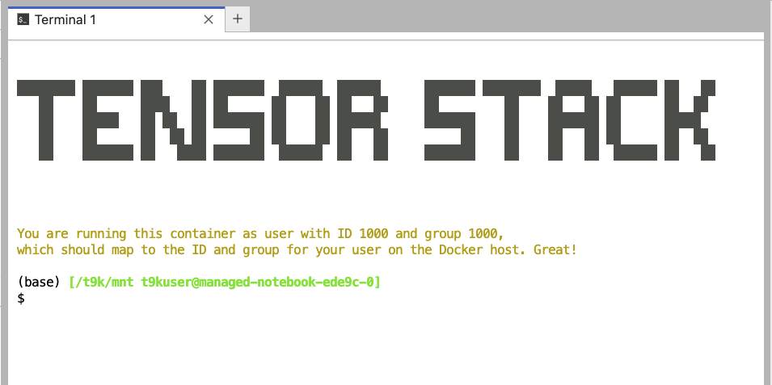

# JupyterLab 使用中的常见问题

本文档整理了一些在使用 JupyterLab App 的过程中可能遇到的常见问题和相应的解决方案，作为 JupyteLab 的[使用方法](../../app/jupyterlab.md#使用方法)和[使用说明](../../app/jupyterlab.md#使用说明)部分的补充。请先阅读这两部分的内容，然后再参阅本文档。

## 如何上传下载文件

请参阅[上传和下载文件的 Jupyter Lab App UI 部分](./upload-and-download-file.md#jupyter-lab-app-ui)。

## 如何查看挂载 PVC 的剩余存储空间

在 JupyterLab 的终端中执行以下命令：

```bash
df -h | grep -e "Filesystem" -e "Mounted on" -e "/t9k/mnt"
```

返回的结果类似于：

```
Filesystem
Size  Used Avail Use% Mounted on
100.64.4.102:6789,100.64.4.104:6789:/volumes/csi/csi-vol-a5718ceb-20d4-47c5-8300-a1a45e9c005c/0bc64bd4-81a7-4c98-aeaf-0dd5a7ec975b
16G   10G  6.1G  63% /t9k/mnt
```

4 个指标从左到右分别为总存储空间、已使用的存储空间、可用的存储空间和使用百分比。

## 如何查看目录和文件的权限、大小等信息

在 JupyterLab 的终端中，执行以下命令以查看指定目录下的各个子目录和文件的权限、所属用户、所属用户组、大小和修改时间信息，以及它们的总大小：

```bash
ls <DIR> -lh  # 省略 <DIR> 表示当前目录
```

注意上面的命令返回的子目录大小为目录的**元数据**的大小。如要查看指定目录占用的存储空间大小（递归地遍历该目录下的所有子目录和文件），执行以下命令：

```bash
du <DIR> -sh
du <DIR> -h --max-depth=1  # 额外展示深度不大于 1 的子目录占用的存储空间大小
```

## 如何使用 conda 环境

选用**包含 conda 环境**的[镜像](../../app/jupyterlab.md#镜像)配置和安装 App。进入 JupyterLab，启动一个终端，可以看到 prompt 显示前缀 `(base)`，表示当前 conda 环境 base 已被激活：

<figure class="screenshot">
  
</figure>

然后正常执行 conda 命令即可。

conda 的使用方法请参阅 [User guide](https://docs.conda.io/projects/conda/en/stable/user-guide/index.html)。

<aside class="note">
<div class="title">注意</div>

新创建的 conda 环境和下载的 conda 包的文件存放在 `/t9k/mnt/.conda` 路径下；请确保挂载的 PVC 留有足够的存储空间。

</aside>

## 如何通过 SSH 远程连接

## 无法使用 sudo 命令

原因可能是：

1. 未选用**标签带有 `-sudo` 后缀**的镜像
2. T9k admission 禁止了容器使用 privileged 权限，或者禁止了权限提升

如果你排除了原因 1，请联系平台的管理员寻求解决。

## 命令执行失败，显示 Killed

原因是进程因为内存不足被杀掉。请重新配置和安装 App，配置时申请更多的内存资源。
