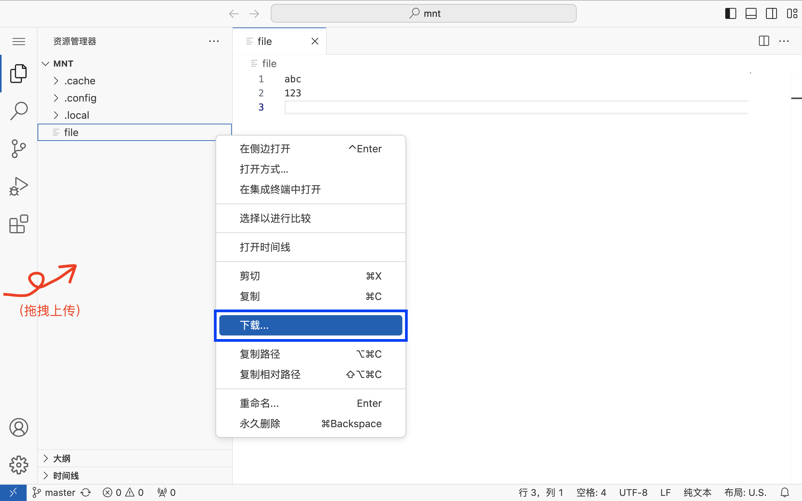
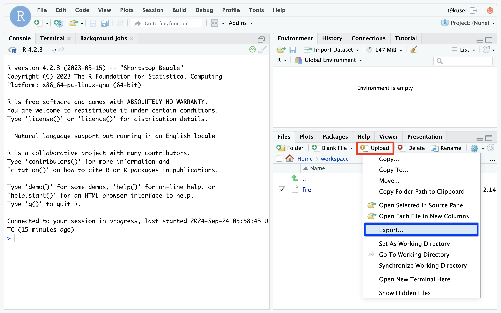
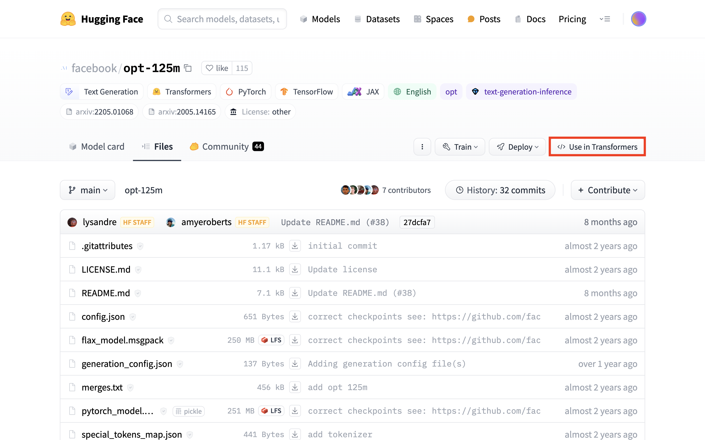

# 上传和下载文件

通过 [PVC](../../api/storage/pvc.md) 使用集群存储非常方便，它可以作为存储卷被挂载到 JupyterLab App、Job、MLService 等各种工作负载的 Pod 中。例如在进行模型训练时，你可以把训练脚本以及训练数据存放到 PVC，然后挂载在 Job 的 Pod 中。

本教程将分场景介绍从集群外部下载/上传文件到 PVC，以及从 PVC 上传/下载文件到集群外部的若干方法。

由于下面的方法需要使用到一些命令行工具或 Python 库，而 [JupyterLab](../../app/jupyterlab.md) App 提供了终端并且预装了这些命令行工具和 Python 库，因此我们推荐创建一个 JupyterLab App 挂载 PVC，然后在其终端中进行操作。

<aside class="note tip">
<div class="title">提示</div>

对于使用命令行工具 `wget`（或 `curl`）、`git` 或 `kubectl` 的方法，也可以在 [Terminal](../../app/terminal.md) App 中进行操作。

</aside>

<aside class="note tip">
<div class="title">提示</div>

Ceph 类型的 PVC 可以扩容，即增加存储卷大小。因此你在创建该类型的 PVC 时可以先指定一个较为保守的存储卷大小的值，之后如有需要则继续增加。

NFS 类型的 PVC 不可扩容。

</aside>

## 准备工作

* 了解 [JupyterLab](../../app/jupyterlab.md)、[Terminal](../../app/terminal.md) 和 [File Browser](../../app/filebrowser.md) App
* 了解 [DataCube](../../api/datacube.md) API

## 本地文件系统

<aside class="note">
<div class="title">注意</div>

在[这一部分](#本地文件系统)，PVC **导入**文件称为**上传**，**导出**文件称为**下载**。在本教程的其余部分则相反，PVC **导入**文件称为**下载**，**导出**文件称为**上传**。

</aside>

### JupyterLab UI

将 PVC 挂载到 [JupyterLab](../../app/jupyterlab.md) App 上，本地文件系统和 PVC 之间的文件上传下载可以直接在 UI 中进行操作：

<figure class="screenshot">
  
</figure>

<aside class="note">
<div class="title">注意</div>

* JupyterLab 不限制上传或下载的单个文件的大小，但上传和下载过程容易因为网络波动而出错，建议 > ~2GB（也取决于具体网络环境）的单个文件使用其他方法上传或下载。
* JupyterLab 不限制单次上传的文件数量，但在文件数量较多的情况下容易出错，建议文件数量 > 30（也取决于具体网络环境）时打包成压缩文件再上传；单次下载最多 10 个文件。

</aside>

### Code Server UI

将 PVC 挂载到 [Code Server](../../app/codeserver.md) App 上，本地文件系统和 PVC 之间的文件上传下载可以直接在 UI 中进行操作：

<figure class="screenshot">
  
</figure>

<aside class="note">
<div class="title">注意</div>

* Code Server 不限制上传或下载的单个文件的大小，但上传和下载过程容易因为网络波动而出错，建议 > ~5GB（也取决于具体网络环境）的单个文件使用其他方法上传或下载。此外，下载过程还会占用大量内存，在下载 >~1GB 的单个文件之前需要确保留有 8GB 的可用内存。
* Code Server 不限制单次上传的文件数量，并且支持上传整个目录，在小文件数量较多的情况下也不容易出错；不限制单次下载的文件数量，但在文件数量较多的情况下容易遗漏，建议文件数量 > 20 时打包成压缩文件再下载。
* 下载文件时偶尔会弹出 `Can't open this folder` 对话框，这是一个已知的<a target="_blank" rel="noopener noreferrer" href="https://github.com/coder/code-server/issues/4646">问题</a>。一个解决方案是下载到当前用户的 `Pictures` 目录下。

</aside>

### RStudio UI

将 PVC 挂载到 [RStudio](../../app/rstudio.md) App 上，本地文件系统和 PVC 之间的文件上传下载可以直接在 UI 中进行操作：

<figure class="screenshot">
  
</figure>

<aside class="note">
<div class="title">注意</div>

* RStudio 限制上传的单个文件的大小须 < ~800MB，不限制下载的单个文件的大小。
* RStudio 限制单次上传和下载的文件数量为 1。要上传多个文件或整个目录，可以将它们打包为一个 ZIP 压缩文件，上传后 ZIP 文件会自动解压；单次下载多个文件或整个目录时下载的也是包含这些文件或目录的 ZIP 文件。

</aside>

### File Browser UI

将 PVC 挂载到 [File Browser](../../app/filebrowser.md) App 上，本地文件系统和 PVC 之间的文件上传下载可以直接在 UI 中进行操作：

<figure class="screenshot">
  
</figure>

<aside class="note">
<div class="title">注意</div>

* 根据管理员配置，File Browser 有可能限制上传的单个文件的大小。与此同时，上传和下载过程也容易因为网络波动而出错，建议 > ~2GB（也取决于具体网络环境）的单个文件使用其他方法上传或下载。
* File Browser 不限制单次上传的文件数量，并且支持上传整个目录，在小文件数量较多的情况下也不容易出错；单次下载多个文件或整个目录时下载的是包含这些文件或目录的压缩包，可以选择压缩格式。

</aside>

### 云存储中转

也可以通过其他云存储服务进行中转，即**本地 → 云存储 → PVC**：

1. 本地与云存储之间的文件传输方法请参阅相应云存储的文档；
2. 云存储与 PVC 之间的文件传输方法请参阅[云存储服务](#云存储服务)。

## 云存储服务

### `rclone` 命令

要在云存储与 PVC 之间复制或同步文件，可以使用命令行工具 <a target="_blank" rel="noopener noreferrer" href="https://rclone.org">rclone</a>。这里以 Amazon S3 为例，首先参照 <a target="_blank" rel="noopener noreferrer" href="https://rclone.org/s3/">Amazon S3 Config</a> 进行配置，完成后执行以下命令：

```bash
rclone copy <REMOTE>:<BUCKET>/path/to/the/file .   # 从 S3 存储下载
rclone copy ./file <REMOTE>:<BUCKET>/path/to/the/  # 上传到 S3 存储

rclone sync <REMOTE>:<BUCKET>/path/to/the/dir .    # 从 S3 存储同步
rclone sync . <REMOTE>:<BUCKET>/path/to/the/dir    # 同步到 S3 存储
```

<aside class="note info">
<div class="title">信息</div>

rclone 支持的云存储提供商请参阅 <a target="_blank" rel="noopener noreferrer" href="https://rclone.org/#providers">Supported Providers</a>。

</aside>

对于 Amazon S3，除了 rclone 之外还有其他命令行工具可供使用，例如 <a target="_blank" rel="noopener noreferrer" href="https://github.com/s3tools/s3cmd">s3cmd</a>、<a target="_blank" rel="noopener noreferrer" href="https://github.com/peak/s5cmd">s5cmd</a> 等。

### DataCube

对于 Amazon S3 也可以使用平台提供的 [DataCube](../../api/datacube.md)。使用以下 YAML 配置文件创建 DataCube（修改 PVC 名称、PVC 路径、Secret 名称和 S3 URL）以下载和上传文件：

<details><summary><code class="hljs">download-s3.yaml</code></summary>

```yaml
{{#include ../../assets/guide/theme/upload-and-download-file/download-s3.yaml}}
```

</details>

<details><summary><code class="hljs">upload-s3.yaml</code></summary>

```yaml
{{#include ../../assets/guide/theme/upload-and-download-file/upload-s3.yaml}}
```

</details>

```bash
kubectl create -f download-s3.yaml
kubectl create -f upload-s3.yaml
```

## HTTP/FTP 服务

### wget 命令

要通过 HTTP(S)、(S)FTP 等协议从网络下载文件到 PVC，可以在终端中使用 `wget`（或 `curl`）命令进行下载：

```bash
wget <URL>

# 或

curl -O <URL>
```

<aside class="note tip">
<div class="title">提示</div>

你也可以在终端中使用命令行工具 rclone 来访问和下载存储在 HTTP(S) 和 FTP(S) 服务器上的文件（对于 FTP(S) 服务器还可以上传文件）。rclone 将这些服务器视为一种类型的云存储，请参阅 <a target="_blank" rel="noopener noreferrer" href="https://rclone.org/http/">HTTP Config</a> 和 <a target="_blank" rel="noopener noreferrer" href="https://rclone.org/ftp/">FTP Config</a>。

</aside>

## Git 仓库

### `git` 命令

可以在终端中使用 `git` 命令，从 GitHub 等代码托管平台克隆或拉取 Git 仓库，并在提交修改后推送回去：

```bash
git clone <REPO_URL>
git pull
git fetch
git push
```

### DataCube

也可以使用平台提供的 [DataCube](../../api/datacube.md)。使用以下 YAML 配置文件创建 DataCube（修改 PVC 名称、PVC 路径、Git 仓库 URL 和 Git ref）以克隆（或拉取）和推送提交到 Git 仓库：

<details><summary><code class="hljs">download-git.yaml</code></summary>

```yaml
{{#include ../../assets/guide/theme/upload-and-download-file/download-git.yaml}}
```

</details>

<details><summary><code class="hljs">upload-git.yaml</code></summary>

```yaml
{{#include ../../assets/guide/theme/upload-and-download-file/upload-git.yaml}}
```

</details>

```bash
kubectl create -f download-git.yaml
kubectl create -f upload-git.yaml
```

## Hugging Face

<a target="_blank" rel="noopener noreferrer" href="https://huggingface.co/">Hugging Face</a> 是一个 AI 开源社区，其提供的 Git 仓库托管了大量流行的开源模型和数据集。

这里介绍从 Hugging Face 下载模型文件到 PVC（以模型 <a target="_blank" rel="noopener noreferrer" href="https://huggingface.co/facebook/opt-125m">`facebook/opt-125m`</a> 为例），以及从 PVC 上传模型文件到 Hugging Face（以用户自己创建的模型 `user/llm` 为例）的若干方法。数据集类似。

### `git` 命令

Hugging Face 模型或数据集本身就是一个 Git 仓库，因此可以参照 [Git 仓库](#git-仓库)的方法。需要注意的是：

* Git 仓库的 HTTPS URL 为 `https://huggingface.co/<OWNER>/<MODEL_OR_DATASET_NAME>`，例如模型 `facebook/opt-125m` 的 HTTPS URL 为 `https://huggingface.co/facebook/opt-125m`。
* Git LFS 被用于管理大于 10MB 的文件（JupyterLab App 已经安装了 Git LFS，并在启动时进行了初始化）。如要推送大于 10MB 的文件，请先通过 Git LFS 追踪该文件：

    ```bash
    git lfs track large_file
    git add large_file
    git commit -m "Add the large file"
    git push
    ```

* 如要访问受保护的模型或数据集（例如模型 `meta-llama/Meta-Llama-3-8B`），访问私有模型或数据集，或推送提交到模型或数据集，则需要提供拥有相应权限的用户的用户名和 token：

    ```bash
    # 克隆受保护的模型的 Git 仓库
    git clone https://<HF_USERNAME>:<HF_TOKEN>@huggingface.co/meta-llama/Meta-Llama-3-8B

    # 克隆私有模型的 Git 仓库
    git clone https://<HF_USERNAME>:<HF_TOKEN>@huggingface.co/user/private-llm

    # 克隆模型的 Git 仓库并在提交修改后推送回去
    git clone https://<HF_USERNAME>:<HF_TOKEN>@huggingface.co/user/llm
    git add ...
    git commit ...
    git push
    ```

### `transformers` 库和 `datasets` 库

可以使用 <a target="_blank" rel="noopener noreferrer" href="https://github.com/huggingface/transformers">`transformers` 库</a>下载和上传模型文件以及 tokenizer 文件。使用浏览器访问模型 `facebook/opt-125m` 的 <a target="_blank" rel="noopener noreferrer" href="https://huggingface.co/facebook/opt-125m/tree/main">Files 标签页</a>。点击 **Use in Transformers**，按照提示进行操作，即在 Python 程序中调用 `transformers` 库加载模型。首次加载时，仓库中的模型文件和 tokenizer 文件会被下载到缓存目录下，即 PVC 的 `.cache/huggingface/hub/models--facebook--opt-125m/` 路径下。

<figure class="screenshot">
  
</figure>

<figure class="screenshot">
  
</figure>

```python
from transformers import pipeline
pipe = pipeline("text-generation", model="facebook/opt-125m")

# 或

from transformers import AutoTokenizer, AutoModelForCausalLM
tokenizer = AutoTokenizer.from_pretrained("facebook/opt-125m")
model = AutoModelForCausalLM.from_pretrained("facebook/opt-125m")
```

对于受保护的或私有的模型（例如模型 `meta-llama/Meta-Llama-3-8B`），需要提供拥有读权限的用户的 token：

```python
from transformers import pipeline
pipe = pipeline("text-generation", model="meta-llama/Meta-Llama-3-8B", token="<HF_TOKEN>")

# 或

from transformers import AutoTokenizer, AutoModelForCausalLM
tokenizer = AutoTokenizer.from_pretrained("meta-llama/Meta-Llama-3-8B", token="<HF_TOKEN>")
model = AutoModelForCausalLM.from_pretrained("meta-llama/Meta-Llama-3-8B", token="<HF_TOKEN>")
```

使用 <a target="_blank" rel="noopener noreferrer" href="https://github.com/huggingface/datasets">`datasets` 库</a>下载和上传数据集文件。相比加载模型，加载数据集要更加复杂一些，请参阅教程
<a target="_blank" rel="noopener noreferrer" href="https://huggingface.co/docs/datasets/load_hub">Load a dataset</a> 和 <a target="_blank" rel="noopener noreferrer" href="https://huggingface.co/docs/datasets/loading">Load</a>。

调用<a target="_blank" rel="noopener noreferrer" href="https://huggingface.co/docs/transformers/main_classes/model#transformers.PreTrainedModel">模型对象</a>、<a target="_blank" rel="noopener noreferrer" href="https://huggingface.co/docs/transformers/main_classes/tokenizer#transformers.PreTrainedTokenizer">tokenizer 对象</a>或<a target="_blank" rel="noopener noreferrer" href="https://huggingface.co/docs/datasets/package_reference/main_classes#datasets.Dataset">数据集对象</a>的 `push_to_hub()` 方法以将其文件上传到仓库，需要提供拥有写权限的用户的 token：

```python
...
model.push_to_hub("user/llm", token="<HF_TOKEN>")
tokenizer.push_to_hub("user/llm", token="<HF_TOKEN>")
dataset.push_to_hub("user/data", token="<HF_TOKEN>")
```

<aside class="note info">
<div class="title">信息</div>

对于上传，更详细的教程请参阅 <a target="_blank" rel="noopener noreferrer" href="https://huggingface.co/docs/transformers/model_sharing">Share a model</a> 和 <a target="_blank" rel="noopener noreferrer" href="https://huggingface.co/docs/datasets/upload_dataset">Share a dataset</a>。

</aside>

### `huggingface-cli` 命令和 `huggingface_hub` 库

可以使用 `huggingface-cli download` 命令下载仓库中的所有文件或指定文件：

```bash
# 下载所有文件
huggingface-cli download facebook/opt-125m

# 下载单个指定文件
huggingface-cli download facebook/opt-125m pytorch_model.bin

# 下载多个指定文件
huggingface-cli download facebook/opt-125m pytorch_model.bin generation_config.json

# 模式匹配
huggingface-cli download facebook/opt-125m --include="*.bin"
huggingface-cli download facebook/opt-125m --exclude="*.bin"

# 指定缓存目录
huggingface-cli download facebook/opt-125m --cache-dir .

# 下载数据集文件
huggingface-cli download cais/mmlu all/test-00000-of-00001.parquet --repo-type=dataset
```

可以指定放置下载文件的本地目录，否则文件会被放置到与 [`transformers` 库](#transformers-库)相同的缓存目录下：

```bash
# 文件被放置到缓存目录下
huggingface-cli download facebook/opt-125m

# 文件被放置到指定的本地目录下，其中大于 10MB 的文件会被替换为指向相应缓存文件的符号链接
huggingface-cli download facebook/opt-125m --local-dir "opt-125m"

# 文件被放置到指定的本地目录下
huggingface-cli download facebook/opt-125m --local-dir "opt-125m" --local-dir-use-symlinks False
```

对于受保护的或私有的模型或数据集（例如模型 `meta-llama/Meta-Llama-3-8B`），需要提供拥有读权限的用户的 token：

```bash
huggingface-cli login --token <HF_TOKEN>  # 登录到 Hugging Face
huggingface-cli download meta-llama/Meta-Llama-3-8B

# 或

huggingface-cli download meta-llama/Meta-Llama-3-8B --token <HF_TOKEN>
```

使用 `huggingface-cli upload` 命令上传文件或整个目录到仓库，需要提供拥有写权限的用户的 token：

```bash
# Usage: huggingface-cli upload <REPO_ID> <LOCAL_PATH> [REPO_PATH]

huggingface-cli login --token <HF_TOKEN>  # 登录到 Hugging Face
huggingface-cli upload user/llm . .                       # 上传整个目录
huggingface-cli upload user/llm ./pytorch_model.bin       # 上传单个指定文件
huggingface-cli upload user/llm . . --exclude="/logs/*"   # 模式匹配
huggingface-cli upload user/data . . --repo-type=dataset  # 上传数据集文件

# 或

huggingface-cli upload user/llm . . --token <HF_TOKEN>
```

<aside class="note info">
<div class="title">信息</div>

更详细的教程请参阅 <a target="_blank" rel="noopener noreferrer" href="https://huggingface.co/docs/huggingface_hub/main/en/guides/cli#huggingface-cli-download">huggingface-cli download</a> 和 <a target="_blank" rel="noopener noreferrer" href="https://huggingface.co/docs/huggingface_hub/main/en/guides/cli#huggingface-cli-upload">huggingface-cli upload</a>。

</aside>

实际上，`huggingface-cli` 是 <a target="_blank" rel="noopener noreferrer" href="https://huggingface.co/docs/huggingface_hub/index">`huggingface_hub` 库</a>的命令行工具。`huggingface-cli download` 命令在内部调用了该库的 <a target="_blank" rel="noopener noreferrer" href="https://huggingface.co/docs/huggingface_hub/main/en/package_reference/file_download#huggingface_hub.hf_hub_download">`hf_hub_download()`</a> 和 <a target="_blank" rel="noopener noreferrer" href="https://huggingface.co/docs/huggingface_hub/main/en/package_reference/file_download#huggingface_hub.snapshot_download">`snapshot_download()`</a> 函数，`huggingface-cli upload` 命令在内部调用了该库的 <a target="_blank" rel="noopener noreferrer" href="https://huggingface.co/docs/huggingface_hub/main/en/package_reference/hf_api#huggingface_hub.HfApi.upload_file">`upload_file()`</a> 和 <a target="_blank" rel="noopener noreferrer" href="https://huggingface.co/docs/huggingface_hub/main/en/package_reference/hf_api#huggingface_hub.HfApi.upload_folder">`upload_folder()`</a> 函数。我们同样可以在 Python 程序中调用该库的这些函数来下载和上传文件，这里不再展开，请参阅教程 <a target="_blank" rel="noopener noreferrer" href="https://huggingface.co/docs/huggingface_hub/main/en/guides/download">Download files</a> 和 <a target="_blank" rel="noopener noreferrer" href="https://huggingface.co/docs/huggingface_hub/main/en/guides/upload">Upload files</a>。

### `wget` 命令

如果只需要下载个别文件，那么也可以复制相应文件的下载链接，然后在终端中使用 `wget`（或 `curl`）命令下载：

```bash
wget https://huggingface.co/facebook/opt-125m/resolve/main/pytorch_model.bin?download=true -O pytorch_model.bin

# 或

curl -L https://huggingface.co/facebook/opt-125m/resolve/main/pytorch_model.bin?download=true -o pytorch_model.bin
```

对于受保护的或私有的模型或数据集（例如模型 `meta-llama/Meta-Llama-3-8B`），需要提供拥有读权限的用户的 token：

```bash
wget --header="Authorization: Bearer <HF_TOKEN>" https://huggingface.co/meta-llama/Meta-Llama-3-8B/resolve/main/model-00001-of-00004.safetensors?download=true -O model-00001-of-00004.safetensors

# 或

curl --header "Authorization: Bearer <HF_TOKEN>" -L https://huggingface.co/meta-llama/Meta-Llama-3-8B/resolve/main/model-00001-of-00004.safetensors?download=true -o model-00001-of-00004.safetensors
```

### DataCube

也可以使用平台提供的 [DataCube](../../api/datacube.md)，其在内部调用的就是 [`huggingface-cli` 命令](#huggingface-cli-命令和-huggingface_hub-库)。使用以下 YAML 配置文件创建 DataCube（修改 PVC 名称、PVC 路径和 Hugging Face 仓库 ID）以下载和上传文件：

<details><summary><code class="hljs">download-hf.yaml</code></summary>

```yaml
{{#include ../../assets/guide/theme/upload-and-download-file/download-hf.yaml}}
```

</details>

<details><summary><code class="hljs">upload-hf.yaml</code></summary>

```yaml
{{#include ../../assets/guide/theme/upload-and-download-file/upload-hf.yaml}}
```

</details>

```bash
kubectl create -f download-hf.yaml
kubectl create -f upload-hf.yaml
```

## ModelScope

<a target="_blank" rel="noopener noreferrer" href="https://modelscope.cn/">ModelScope</a> 是一个中文 AI 开源社区，可以视作中国版的 Hugging Face。ModelScope 上托管的模型和数据集相比 Hugging Face 要少得多，但对于国内用户，访问 ModelScope 的网络连通性更好。

这里介绍从 ModelScope 下载模型文件到 PVC（以模型 <a target="_blank" rel="noopener noreferrer" href="https://modelscope.cn/models/AI-ModelScope/opt-125/">`AI-ModelScope/opt-125`</a> 为例），以及从 PVC 上传模型文件到 ModelScope（以用户自己创建的模型 `user/llm` 为例）的若干方法。数据集类似。

### `git` 命令

与 [Hugging Face](#git-命令-1) 类似，除了：

* Git 仓库的 HTTPS URL 为 `https://www.modelscope.cn/<OWNER>/<MODEL_OR_DATASET_NAME>.git`，例如模型 `AI-ModelScope/opt-125` 的 HTTPS URL 为 `https://www.modelscope.cn/AI-ModelScope/opt-125.git`。
* Git LFS 被用于管理大于 100MB 的文件（JupyterLab App 已经安装了 Git LFS，并在启动时进行了初始化）。如要推送大于 100MB 的文件，请先通过 Git LFS 追踪该文件：

    ```bash
    git lfs track large_file
    git add large_file
    git commit -m "Add the large file"
    git push
    ```
* 如要访问受保护的模型或数据集，访问私有模型或数据集，或推送提交到模型或数据集，则需要提供拥有相应权限的用户的 token：

    ```bash
    # 克隆私有模型的 Git 仓库
    git clone http://oauth2:<MODELSCOPE_TOKEN>@www.modelscope.cn/user/private-llm.git

    # 克隆模型的 Git 仓库并在提交修改后推送回去
    git clone http://oauth2:<MODELSCOPE_TOKEN>@www.modelscope.cn/user/llm.git
    git add ...
    git commit ...
    git push
    ```

### `modelscope` 库

可以使用 `modelscope` 库下载和上传文件。第一种下载模型文件的方法类似于 [`transformers` 库](#transformers-库和-datasets-库)（在内部也调用了 `transformers` 库）。首次加载时，仓库中的所有文件会被下载到缓存目录下，即 PVC 的 `.cache/modelscope/hub/AI-ModelScope/opt-125/` 路径下。

```python
from modelscope.models import Model
model = Model.from_pretrained("AI-ModelScope/opt-125")
```

第二种下载模型文件的方法类似于 [`huggingface_hub` 库](#huggingface-cli-命令和-huggingface_hub-库)。文件会被下载到与第一种方法相同的缓存目录下。

```python
from modelscope import snapshot_download
from modelscope.hub.file_download import model_file_download

snapshot_download("AI-ModelScope/opt-125")                                   # 下载所有文件
model_file_download("AI-ModelScope/opt-125", file_path="pytorch_model.bin")  # 下载单个指定文件
snapshot_download("AI-ModelScope/opt-125", cache_dir=".")                    # 指定缓存目录
```

第三种下载模型文件的方法类似于 `huggingface-cli` 命令，可以使用 `modelscope download` 命令下载仓库中的所有文件或指定文件：

```bash
# 下载所有文件
modelscope download --model "AI-ModelScope/opt-125"

# 下载单个指定文件
modelscope download --model "AI-ModelScope/opt-125" pytorch_model.bin

# 下载多个指定文件
modelscope download --model "AI-ModelScope/opt-125" pytorch_model.bin tf_model.h5

# 模式匹配
modelscope download --model "AI-ModelScope/opt-125" --include "*.bin"
modelscope download --model "AI-ModelScope/opt-125" --exclude "*.bin"

# 指定下载目录
modelscope download --model "AI-ModelScope/opt-125" --local_dir "./opt-125m"
```

可以指定放置下载文件的本地目录，否则文件会被放置到与第一种方法相同的缓存目录下：

```bash
# 文件被放置到缓存目录下
modelscope download --model "AI-ModelScope/opt-125"

# 文件被放置到指定的本地目录下
modelscope download --model "AI-ModelScope/opt-125" --local_dir "./opt-125m"
```

下载数据集文件的方法类似于 [`datasets` 库](#transformers-库和-datasets-库)。这里以数据集 MMLU 的子集 Abstract Algebra 为例，注意不同的数据集拥有不同的可用子集。首次加载时，仓库中的数据集文件会被下载到缓存目录下，即 PVC 的 `.cache/modelscope/hub/datasets/mmlu/abstract_algebra/` 路径下。

```python
from modelscope.msdatasets import MsDataset
dataset = MsDataset.load("mmlu", subset_name="abstract_algebra")
```

对于受保护的或私有的模型或数据集，需要提供拥有读权限的用户的 token：

```python
from modelscope import HubApi

api=HubApi()
api.login("<MODELSCOPE_TOKEN>")  # 登录到 ModelScope

# 然后参照上面的方法下载
```

上传模型文件的方法如下所示。`modelscope` 库暂不支持上传数据集文件。

```python
from modelscope.hub.api import HubApi

api = HubApi()
api.login("<MODELSCOPE_TOKEN>")  # 登录到 ModelScope

api.push_model(
    model_id="<OWNER>/<MODEL_NAME>",
    model_dir="<LOCAL_PATH>"     # 本地模型目录，要求目录中必须包含 configuration.json
)
```

## 大规模数据

在处理大规模数据（如 100TB 级别）的导入和导出时，根据数据源的不同，我们采用不同的策略以确保数据传输的效率和安全性。以下是针对不同数据源的一些方法：

数据源为云存储时：

* 参照[云存储服务](#云存储服务)操作。

数据源为 HDD/SDD 外置驱动器或类似设备时：

1. 将驱动器连接到集群外的与集群网络连接速度较快的计算机上，然后参照[本地文件系统](#本地文件系统)继续操作。
2. 或者，请求管理员操作，将驱动器连接到存储集群的节点上，直接使用存储系统的工具进行数据传输。这种方法的数据传输速度一般较快，但需要能够访问存储集群的工具和接口。

## 参考

* <a target="_blank" rel="noopener noreferrer" href="https://rclone.org/">rclone</a>
* <a target="_blank" rel="noopener noreferrer" href="https://github.com/s3tools/s3cmd">s3cmd</a>
* <a target="_blank" rel="noopener noreferrer" href="https://github.com/peak/s5cmd">s5cmd</a>
* <a target="_blank" rel="noopener noreferrer" href="https://huggingface.co/">Hugging Face</a>
    * <a target="_blank" rel="noopener noreferrer" href="https://huggingface.co/docs/transformers/">Hugging Face Transformers</a>
    * <a target="_blank" rel="noopener noreferrer" href="https://huggingface.co/docs/datasets/">Hugging Face Datasets</a>
    * <a target="_blank" rel="noopener noreferrer" href="https://huggingface.co/docs/huggingface_hub/">Hugging Face Hub Python Library</a>
* <a target="_blank" rel="noopener noreferrer" href="https://modelscope.cn/">ModelScope</a>
    * <a target="_blank" rel="noopener noreferrer" href="https://modelscope.cn/docs">ModelScope 文档中心</a>
