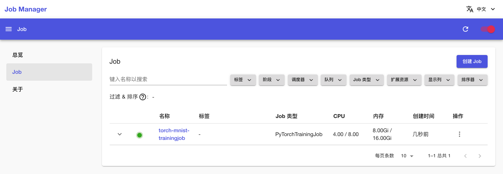

# 进行数据并行训练

本教程演示使用 [PyTorchTrainingJob](../../api/t9k-job/pytorchtrainingjob.md) 对 PyTorch 模型进行多工作器同步训练（使用 <a target="_blank" rel="noopener noreferrer" href="https://pytorch.org/docs/stable/generated/torch.nn.parallel.DistributedDataParallel.html">`torch.nn.parallel.DistributedDataParallel`</a> 分布式数据并行模块）。本教程对应示例<a target="_blank" rel="noopener noreferrer" href="https://github.com/t9k/tutorial-examples/tree/master/job/pytorchtrainingjob/ddp">使用 PyTorchTrainingJob 进行数据并行训练</a>。

本教程的 Apps 架构如下图所示：

<figure class="architecture">
  
</figure>

## 准备工作

创建一个名为 tutorial、大小 1 Gi 的 [PVC](../../api/storage/pvc.md)，然后安装一个同样名为 tutorial 的 [JupyterLab](../../app/jupyterlab.md) App 挂载该 PVC，镜像和资源不限。

进入 JupyterLab，启动一个终端，执行以下命令以克隆 `t9k/tutorial-examples` 仓库：

```bash
cd ~
git clone https://github.com/t9k/tutorial-examples.git
```

## 启动训练（创建 PyTorchTrainingJob）

安装一个 [Job Manager](../../app/job-manager.md) App（如有 Job Manager 则直接复用），进入 Job Manager。在左侧导航菜单点击 **Job** 进入 Job 管理页面，这里展示了所有已创建的 Job。点击右上角的**创建**，然后点击 **PyTorch** 进入 PyTorchTrainingJob 创建页面：

<figure class="screenshot">
    
</figure>

在 PyTorchTrainingJob 创建页面，填写配置如下：

* 基本信息部分：
    * **名称**填写 `torch-mnist-trainingjob`
    * 打开**使用 TorchRun**，**最大重启次数**填写 `3`，**单节点最大进程数**填写 `4`
* worker 部分：
    * **镜像**填写 `t9kpublic/pytorch-1.13.0:sdk-0.5.2`
    * **参数**填写 `torch_mnist_trainingjob.py "--save_path=model_state_dict.pt" "--log_dir=log" "--backend=nccl"`
    * **CPU 上限**和**内存上限**分别填写 `8` 和 `16Gi`，**CPU 请求值**和**内存请求值**分别填写 `4` 和 `8Gi`
    * **GPU** 选择 `nvidia.com/gpu`，**GPU Value** 填写 `4`
    * **工作目录**填写 `/t9k/mnt/tutorial-examples/job/pytorchtrainingjob/ddp`
    * 添加一个**存储卷**，**PersistentVolumeClaim** 选择 `tutorial`，**绑定名称**填写 `data`，**绑定路径**填写 `/t9k/mnt`

然后点击**创建**：

<figure class="screenshot">
    
</figure>

<aside class="note">
<div class="title">注意</div>

目前创建页面暂不支持 `Memory` 类型的卷，直接创建可能报错 Signal 7 (SIGBUS) received by PID x（共享内存不足）。

临时的解决方案是点击**预览 YAML**，将：

```yaml
              volumeMounts:
                - mountPath: /t9k/mnt
                  name: data
          volumes:
            - name: data
              persistentVolumeClaim:
                claimName: tutorial
```

替换为：

```yaml
              volumeMounts:
                - mountPath: /t9k/mnt
                  name: data
                - mountPath: /dev/shm
                  name: dshm
          volumes:
            - name: data
              persistentVolumeClaim:
                claimName: tutorial
            - name: dshm
              emptyDir:
                medium: Memory
```

再点击**创建**。

</aside>

## 查看训练信息（查看 PyTorchTrainingJob 详情）

回到 Job 管理页面，可以看到名为 **torch-mnist-trainingjob** 的 PyTorchTrainingJob 正在运行，点击其**名称**进入详情页面：

<figure class="screenshot">
    
</figure>

可以看到刚才创建的 PyTorchTrainingJob 的基本信息，以及状况和事件信息：

<figure class="screenshot">
    
</figure>

点击上方的**副本**标签页，查看 PyTorchTrainingJob 的 Pod 信息；点击副本右侧的 <span class="twemoji"><svg xmlns="http://www.w3.org/2000/svg" viewBox="0 0 24 24"><path d="M12 16a2 2 0 0 1 2 2 2 2 0 0 1-2 2 2 2 0 0 1-2-2 2 2 0 0 1 2-2m0-6a2 2 0 0 1 2 2 2 2 0 0 1-2 2 2 2 0 0 1-2-2 2 2 0 0 1 2-2m0-6a2 2 0 0 1 2 2 2 2 0 0 1-2 2 2 2 0 0 1-2-2 2 2 0 0 1 2-2Z"></path></svg></span>**&nbsp;> 日志**以查看训练脚本执行过程中的日志输出：

<figure class="screenshot">
    
</figure>

<figure class="screenshot">
    
</figure>

点击上方的**资源监测**标签页，查看 PyTorchTrainingJob 运行过程中使用集群计算资源、网络资源和存储资源的情况：

<figure class="screenshot">
    
</figure>

一段时间之后，PyTorchTrainingJob 的状态变为 **Succeeded**，表示训练成功完成。

<figure class="screenshot">
    
</figure>

若 PyTorchTrainingJob 在运行过程中出错，其状态会变为 **Error**，并在事件信息和 Pod 信息部分显示错误信息，此时需要根据给出的错误信息进行问题排查。

## 查看训练指标

训练产生的 tfevents 文件保存在 PVC 中。回到 JupyterLab，创建一个 TensorBoard 实例。点击 TensorBoard 图标：

<figure class="screenshot">
    
</figure>

直接点击 **Create TensorBoard**：

<figure class="screenshot">
    
</figure>

可以查看可视化展示的训练和验证指标：

<figure class="screenshot">
    
</figure>

<aside class="note">
<div class="title">注意</div>

JupyterLab 的 TensorBoard 实例的自动更新无效，请点击右上角的 **Reload 按钮**以手动更新。

</aside>

<aside class="note tip">
<div class="title">提示</div>

你也可以安装一个 [TensorBoard](../../app/tensorboard.md) App，展示的内容是相同的。

</aside>

## 删除 PyTorchTrainingJob

回到 Job 管理页面，点击 PyTorchTrainingJob 右侧的 <span class="twemoji"><svg xmlns="http://www.w3.org/2000/svg" viewBox="0 0 24 24"><path d="M12 16a2 2 0 0 1 2 2 2 2 0 0 1-2 2 2 2 0 0 1-2-2 2 2 0 0 1 2-2m0-6a2 2 0 0 1 2 2 2 2 0 0 1-2 2 2 2 0 0 1-2-2 2 2 0 0 1 2-2m0-6a2 2 0 0 1 2 2 2 2 0 0 1-2 2 2 2 0 0 1-2-2 2 2 0 0 1 2-2Z"></path></svg></span> **> 删除**，确认以删除 PyTorchTrainingJob：

<figure class="screenshot">
    
</figure>

<aside class="note">
<div class="title">注意</div>

处于 Succeeded 或 Failed 状态的 Job 不会再占用计算资源，因此你不必（也不能）删除这样的 Job 以释放计算资源。

删除 Job 后，Job 的相关信息（包括基本信息、状况、事件、Pod 信息、资源监测等）会丢失，但 Job 产生的、存储在 PVC 中的文件（例如模型检查点、tfevents）会保留。请确认你不再需要查看这个 Job 的相关信息后再删除 Job。

</aside>

<aside class="note tip">
<div class="title">提示</div>

上述关于 Job 的操作全部在 Job Manager 中进行。你也可以参照<a target="_blank" rel="noopener noreferrer" href="https://github.com/t9k/tutorial-examples/tree/master/job/pytorchtrainingjob/ddp">本教程对应的示例</a>的 README 文档进行操作，继续在 JupyterLab 的终端中使用 `kubectl` 命令创建 PyTorchTrainingJob、监控训练进度、查看训练日志以及删除 PyTorchTrainingJob。

</aside>
