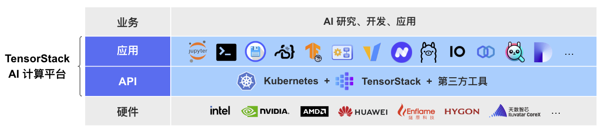

# 概述

## 目标读者

本书《TensorStack AI 计算平台 - User Console 用户手册》 的目标读者是“TensorStack AI 计算平台”的使用者，包括：

- AI 研究人员
- 建模工程师
- 数据处理工程师
- 机器学习工程师
- AI 应用开发工程师等

系统管理员、运维人员需要参考另外的《TensorStack AI 计算平台 - 管理员手册》系列。

## 产品概述

TensorStack AI 计算平台是面向 AI 集群的系统软件，针对 AI 集群的硬件架构和 AI 领域的计算任务的特性和需求，提供稳定、可扩展的 AI 技术平台能力，服务 AI 技术研发、应用和规模化落地。

AI 集群的拥有者可以使用这套软件，构建自己的 AI 私有云或 AI 混合云基础设施服务。

<aside class="note info">

TensorStack AI 计算平台的功能

产品提供两方面的能力：

1. **计算服务**：针对 AI 集群使用者，向上支持各种 AI 计算场景，例如云端开发环境、模型训练、部署推理服务、应用开发等；
1. **集群管理**：针对 AI 集群的管理、运维人员，提供方便的机制，实施各种资源、安全、数据等管理策略。

</aside>

通过先进的架构和丰富的 APIs + Apps，TensorStack AI 计算平台合理地隐藏了分布式并行、异构计算、加速计算等技术的复杂细节，提高了抽象层次，并为 AI 领域的各种计算提供了针对性的支持，极大地提升了 AI 技术研究、开发、应用的工作效率。

<figure class="architecture">
  
  <figcaption>图 1：TensorStack AI 计算平台为 AI 集群提供先进的 AI 基础设施能力。APIs 层提供了可扩展、可编程、云原生的系统服务；Apps 层为多样化的应用场景提供全面、完善的支持：用户可根据需求，安装各种 Apps（IDE、LLM 开发框架、并行训练管理、推理服务管理、资源管理工具、完整的 AI 应用等），满足 AI 研究、开发和应用等业务需求。</figcaption>
</figure>

## User Console

“User Console（用户控制台）” 是 TensorStack AI 计算平台的用户交互界面，它为 AI 集群使用者提供了一个集中使用集群功能的图形化环境。

<figure class="architecture">
  
  <figcaption>图 2：用户登陆 User-Console，安装并使用 Apps，调用 APIs 完成工作。</figcaption>
</figure>

<b>Apps（应用）</b>是 User Console 的核心，作为用户使用平台提供的所有功能的主要入口。无论是进行 AI 研究、开发还是部署，用户都是通过安装和使用相应的 App 来完成。例如：

- AI 研究员可能通过 [JupyterLab App](./app/jupyterlab.md) 作为其日常开发环境，使用 [Job Manager App](./app/job-manager.md) 运行和管理并行训练任务。
- AI 应用工程师可能使用 vLLM App 或 Stable Diffusion WebUI App 来部署和测试 AI 模型。

**APIs** 可以通过 User Console 直接或间接使用，它们或为 Apps 提供必要的支持：

* 存储如**持久卷（PV + PVC）** 和<b>适配器（StorageShim）</b>为 Apps 持久化保存数据，存储模型、数据集和训练日志文件等。
* 网络服务如 **Service** 和 **Ingress** 为 Apps 提供内部通信和外部访问的能力，使得 Apps 能够相互协作并对外提供服务。
* 辅助资源如 **Secret** 和 **ConfigMap** 为 Apps 提供配置管理和敏感信息保护，确保 Apps 能够安全且灵活地运行。

或作为工作负载执行某项特定计算：

* Job 如 **PyTorchTrainingJob** 和 **DeepSpeedJob** 运行以 AI 模型训练为主的批处理计算任务。
* 推理服务如 **MLService** 和 **SimpleMLService** 部署 AI 模型为推理服务。
* 工作流 APIs 将多个平台操作步骤组合为一个工作流，进行集中管理和运行
* **AutoTuneExperiment** 进行 AI 模型训练的自动超参数调优。

<aside class="note info">

Apps + APIs 提供了全面的扩展性

1. Apps 系统提供了用户交互方面的扩展性；用户可根据自己的偏好和习惯，以及工作的内容和性质，灵活地选择合适的 App。
2. APIs 系统提供了系统服务的可扩展性，满足 AI 计算在全领域的系统服务扩展。
3. Apps 及 APIs 均可在线安装及升级，保障集群能力的不中断、在线的扩展能力。

</aside>

除此之外，User Console 还提供了账户设置功能，帮助用户管理账户的项目和 API Key，接受账单和来自平台的告警信息。

## 下一步

* 跟随 [快速开始](./get-started/index.md) 的内容，快速上手平台的基本使用
* 阅读 [Apps](./app/index.md) 和 [APIs](./api/index.md) 章节，了解平台提供的各种 App 和 API
* 参照 [操作指南](./guide/index.md) 的教程，执行更多具体的操作，完成更加复杂的任务
