# 概述

## TensorStack AI 计算平台

TensorStack AI 计算平台是面向 AI 集群的系统软件，针对 AI 集群的硬件架构和 AI 领域的计算任务的特性和需求，提供稳定、可扩展的 AI 技术平台能力，服务 AI 技术研发和规模化落地。

AI 集群的拥有者可以使用这套软件，构建自己的 AI 私有云或 AI 混合云基础设施服务。

<aside class="note info">

TensorStack AI 计算平台的功能

作为基础设施软件，平台提供两方面的能力：

1. **计算服务**：针对 AI 集群使用者，向上支持各种 AI 计算场景，例如云端开发环境、模型训练、部署推理服务、应用开发等；
1. **集群管理**：针对 AI 集群的管理、运维人员，提供方便的机制，实施各种资源、安全、数据等管理策略。

</aside>

通过先进的架构和丰富的 API + 应用，TensorStack AI 计算平台合理地隐藏了分布式并行、异构计算、加速计算等技术的复杂细节，提高了抽象层次，并为 AI 领域的各种计算提供了针对性的支持，极大地提升了 AI 技术研究、开发、应用的工作效率。

<figure class="architecture">
  
  <figcaption>图 1：TensorStack AI 计算平台构建了一个高效的 AI 基础设施生态。Kubernetes 和 TensorStack API，以及第三方工具为多样化的应用提供强大支撑。这些应用工具包括在线 IDE、资源管理工具、AI 应用等，它们直接服务于 AI 研究、开发和应用等核心业务需求。</figcaption>
</figure>

## User Console

User Console 是 TensorStack AI 计算平台的用户界面，为 AI 开发和运维人员提供了一个集中管理和操作平台资源的图形化界面。

**应用**是 User Console 的核心，作为用户使用平台提供的所有功能的主要入口。无论是进行 AI 研究、开发还是部署，用户都是通过部署和使用相应的应用来完成。例如，研究员可能通过 JupyterLab 应用进行数据分析和模型开发，而工程师可能使用 vLLM 或 Stable Diffusion WebUI 来部署和测试 AI 模型。这种以应用为中心的设计使得用户能够直观地访问和管理他们所需的所有 AI 相关工具和服务。

围绕应用，User Console 的其他所有资源都为其提供必要的支持。存储资源如存储卷和适配器确保应用能够持久化数据，存储模型、数据集和训练数据。网络服务包括 Service 和 Ingress，为应用提供内部通信和外部访问的能力，使得应用能够相互协作并对外提供服务。辅助资源如 Secret 和 ConfigMap 则为应用提供配置管理和敏感信息保护，确保应用能够安全且灵活地运行。

除此之外，User Console 还提供了账户设置功能，帮助用户管理账户的项目和 API Key，接受账单和来自平台的告警信息。

用户使用 User Console 的基本交互流程如下：

1. 用户登陆系统
1. 用户在项目中部署并使用应用，必要时创建存储、网络和辅助资源
1. 用户在应用中完成工作（创建计算任务，部署推理服务，使用推理服务，等等）

<figure class="architecture">
  
  <figcaption>图 2：用户登陆系统后在项目中部署并使用应用以完成各种工作。</figcaption>
</figure>
