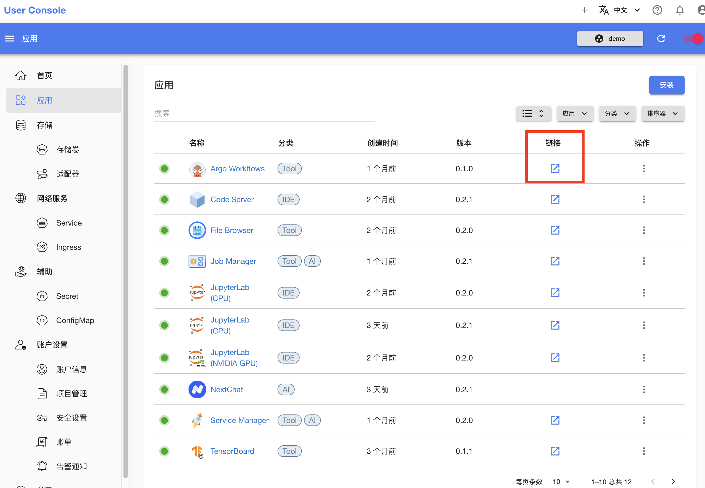
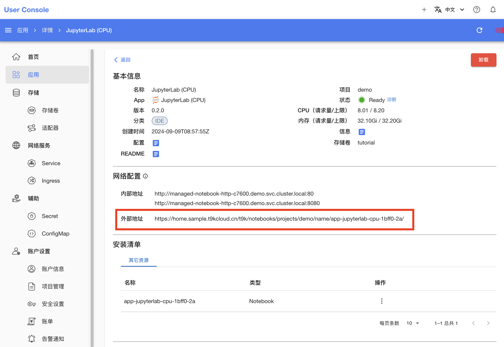
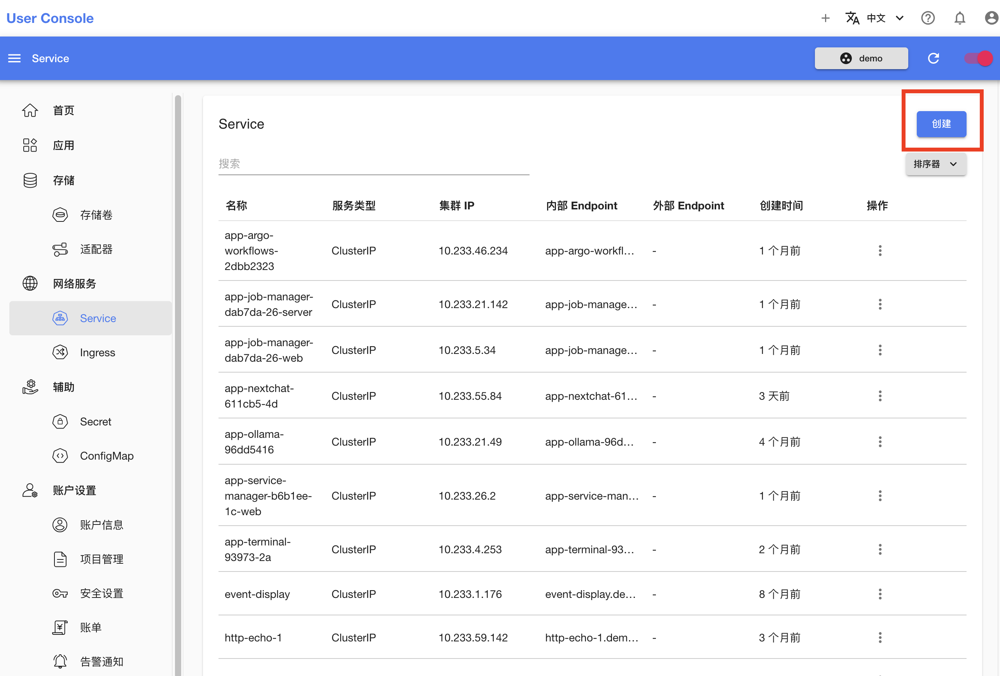
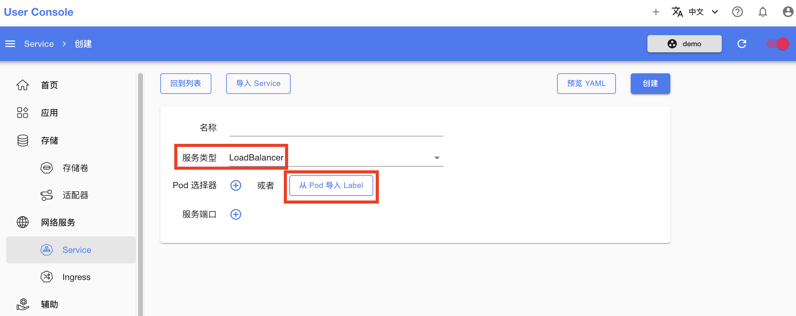
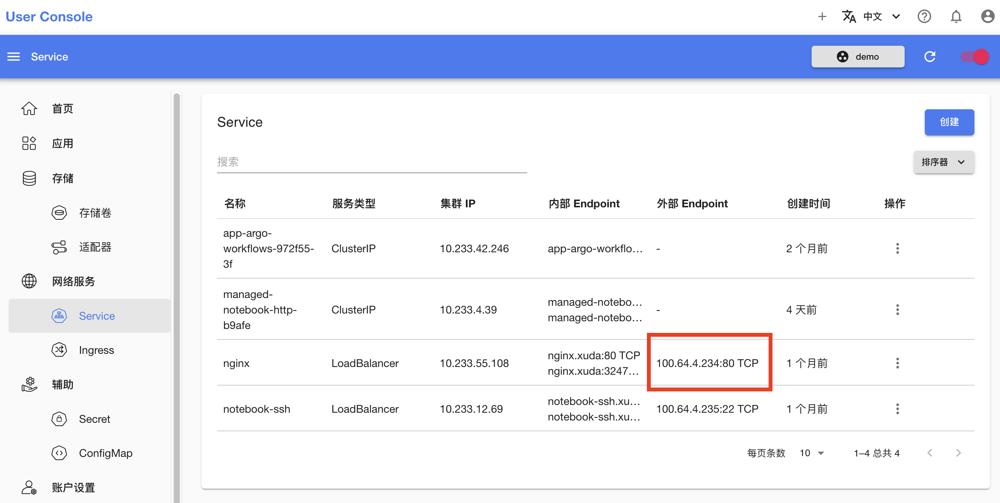

# App 使用中的常见问题

这里整理了一些在使用 App 的过程中可能遇到的常见问题和相应的解决方案。

## App 处于 NotReady 状态

App 处于 NotReady 状态有非常多可能的原因，请[进入 App 的详情页面](../../guide/manage-app/view-app-detail.md)，点击**状态**右侧的**诊断**查看诊断结果以尝试定位原因。下表汇总了一些常见的原因和相应的诊断结果示例：

| 原因                           | 诊断结果示例（Pod 状态）                                                                                                                                                                                     |
| ------------------------------ | ------------------------------------------------------------------------------------------------------------------------------------------------------------------------------------------------------------ |
| 集群的所有节点均没有足够的资源 | 0/10 nodes are available: 1 node(s) had untolerated taint {node-role.kubernetes.io/control-plane: }, 2 node(s) were unschedulable, 3 Insufficient memory, 4 Insufficient cpu, 5 Insufficient nvidia.com/gpu. |
| 超出项目的资源限额             | exceeded quota: demo, requested: cpu=4, used: cpu=6, limited: cpu=8                                                                                                                                          |

<aside class="note tip">

提示

分析诊断结果可能需要具备一定的 Kubernetes 基础并且了解 App 的资源清单，如果你有任何疑问，请询问平台的管理员。

</aside>

## 如何从集群外访问 App

可以通过以下三种方式从集群外访问 App：

1. 网页 UI：如果所部署的 App 包含网页 UI，你可以从 User Console 的应用页面找到入口；
2. 端口转发：如果希望访问 App 的某个端口（例如 SSH 端口、网页 UI 端口、服务器 API 端口），你可以通过 [t9k-pf](../../tool/cli-t9k-pf/index.md) 命令行工具将 App 的端口转发至本地后进行访问；
3. Load Balancer Service：如果当前平台支持 [Load Balancer 类型的 Service](https://kubernetes.io/docs/concepts/services-networking/service/#loadbalancer)，你可以为 App 创建一个 Load Balancer 类型的 Service，通过该 Service 被分配的 IP 地址访问 App。

### 通过网页 UI

在 User Console 的应用列表页面，点击“链接”列中的图标跳转至对应 App 的网页 UI：

<figure class="screenshot">
  
</figure>

或者，在 User Console 的应用详情页面，点击复制 App 的外部地址通过浏览器访问：

<figure class="screenshot">
  
</figure>

### 通过端口转发

通过 [t9k-pf](../../tool/cli-t9k-pf/index.md) 命令行工具，你可以将 App 的任意端口转发至本地后进行访问。[这里](./faq-in-jupyterlab-usage.md#如何通过-ssh-远程连接)展示了如何利用 t9k-pf 访问 JupyterLab 应用的 SSH 端口。

### 通过 Load Balancer Service

<aside class="note">

注意

当前平台是否支持 Load Balancer Service 请询问平台管理员。

</aside>

在 User Console 的 Service 页面，点击“创建”按钮来创建一个 Service：

<figure class="screenshot">
  
</figure>

在 Service 创建页面，首先填写名称，然后选择“服务类型”为 “Load Balancer”，并点击“从 Pod 导入 Label”，选择你想要访问的 Pod，系统将自动解析 Pod 的所有 Label 和所有端口，最后点击“创建”：

<figure class="screenshot">
  
</figure>

创建成功后，你可以从 Service 页面的“外部 Endpoint” 列找到所创建的 Load Balancer Service 被分配的 IP：

<figure class="screenshot">
  
</figure>
