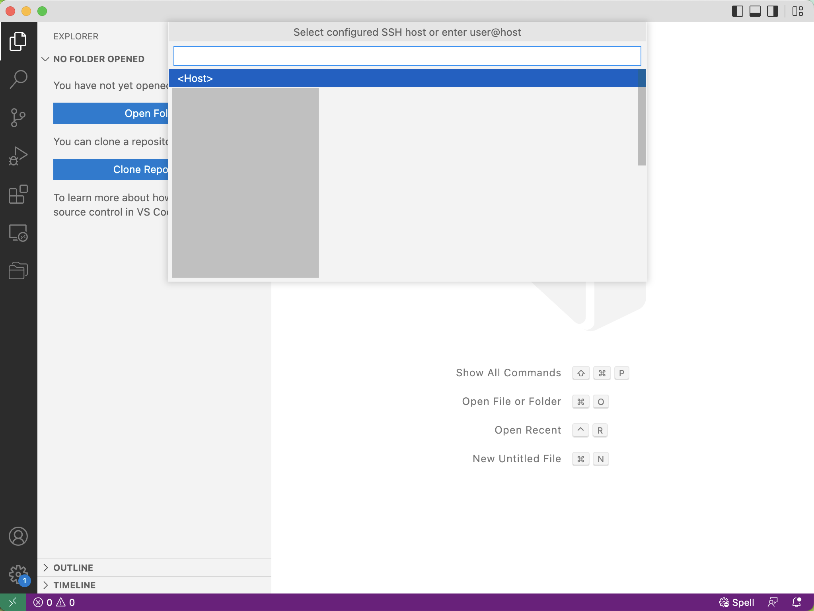
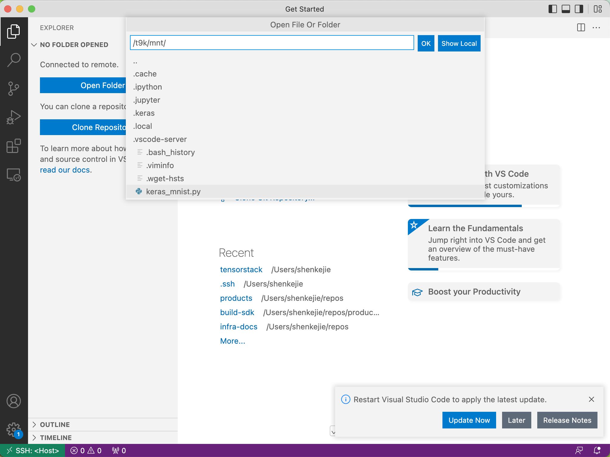
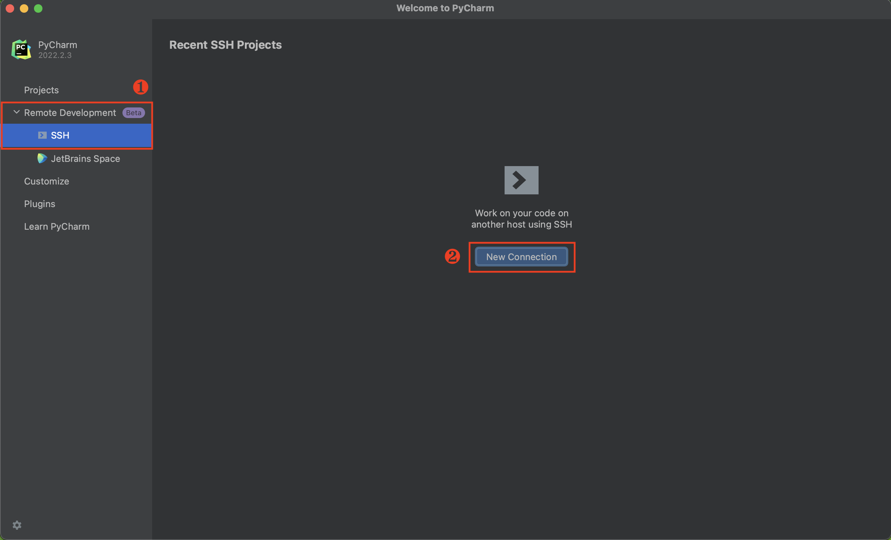

# IDE 使用中的常见问题

这里整理了一些在使用 **IDE 类型** App 的过程中可能遇到的常见问题和相应的解决方案，作为该类型 App 的文档（[JupyterLab](../../app/jupyterlab.md)、[Code Server](../../app/codeserver.md)、[RStudio](../../app/rstudio.md)）的补充。请先阅读这些文档，然后再参阅本文档。

## 如何上传下载文件

请参阅：

* [使用 JupyterLab UI 上传和下载文件](../../guide/theme/upload-and-download-file.md#jupyterlab-app-ui)
* [使用 Code Server UI 上传和下载文件](../../guide/theme/upload-and-download-file.md#code-server-ui)
* [使用 RStudio UI 上传和下载文件](../../guide/theme/upload-and-download-file.md#rstudio-ui)

## 如何查看挂载 PVC 的剩余存储空间

在终端中执行以下命令：

```bash
df -h | grep -e "Filesystem" -e "Mounted on" -e "/t9k/mnt"
```

返回的结果类似于：

```
Filesystem
Size  Used Avail Use% Mounted on
100.64.4.102:6789,100.64.4.104:6789:/volumes/csi/csi-vol-a5718ceb-20d4-47c5-8300-a1a45e9c005c/0bc64bd4-81a7-4c98-aeaf-0dd5a7ec975b
16G   10G  6.1G  63% /t9k/mnt
```

4 个指标从左到右分别为总存储空间、已使用的存储空间、可用的存储空间和使用百分比。

## 如何查看目录和文件的权限、大小等信息

在终端中，执行以下命令以查看指定目录下的各个子目录和文件的权限、所属用户、所属用户组、大小和修改时间信息，以及它们的总大小：

```bash
ls <DIR> -lh  # 省略 <DIR> 表示当前目录
```

注意上面的命令返回的子目录大小为目录的**元数据**的大小。如要查看指定目录占用的存储空间大小（递归地遍历该目录下的所有子目录和文件），执行以下命令：

```bash
du <DIR> -sh
du <DIR> -h --max-depth=1  # 额外展示深度不大于 1 的子目录占用的存储空间大小
```

## 如何使用 conda 环境

选用**包含 conda 环境**的[镜像](../../app/jupyterlab.md#镜像)配置和安装 App。进入 App，启动一个终端，可以看到 prompt 显示前缀 `(base)`，表示当前 conda 环境 base 已被激活：

<figure class="screenshot">
  
</figure>

然后正常执行 conda 命令即可。

conda 的使用方法请参阅 <a target="_blank" rel="noopener noreferrer" href="https://docs.conda.io/projects/conda/en/stable/user-guide/index.html">User guide</a>。

<aside class="note">
<div class="title">注意</div>

新创建的 conda 环境和下载的 conda 包的文件存放在 `/t9k/mnt/.conda` 路径下；请确保挂载的 PVC 留有足够的存储空间。

</aside>

## 如何通过 SSH 远程连接

请跟随以下步骤，在本地通过 SSH 远程连接到 App。

### 创建 Secret

App 的 SSH 服务仅支持基于密钥的身份验证，因此你需要创建包含本地系统的公钥的 Secret 并提供给 App。请参阅[创建 SSH Public Key 模板的 Secret](../../guide/manage-storage-network-and-auxiliary/secret-ssh.md)。

### 配置和安装 App

填写配置时，将 `ssh.enabled` 字段的值设为 `true` 以启用 SSH 服务；将 `ssh.authorizedKeys` 字段的值设为 Secret 列表，其中每个 Secret 包含一个需要远程连接到该 App 的系统的公钥。填写配置完成后，安装 App，等待其就绪。

### 端口转发

#### 命令行工具 t9k-pf

命令行工具 [t9k-pf](../../tool/cli-t9k-pf/index.md) 的功能与 `kubectl port-forward` 命令类似，允许用户通过端口转发的方式，在本地访问 TensorStack AI 平台上的各类资源。

请参照[用户指南](../../tool/cli-t9k-pf/guide.md#用户指南)下载安装 t9k-pf 并配置[身份认证和授权](../../tool/cli-t9k-pf/guide.md#身份认证和授权)。

#### 端口转发命令

查看 App 的信息，复制端口转发的命令，在本地终端执行：

<figure class="screenshot">
  
</figure>

```bash
$ export NB_URL=$(kubectl get notebooks.tensorstack.dev app-jupyterlab-cpu-fb1923-1c -n demo -o "jsonpath={.status.url}")
$ t9k-pf notebook $NB_URL <Port>
Trying to connect [notebooks/app-jupyterlab-cpu-fb1923-1c] in namespace [demo]
now you can forward to your target by 127.0.0.1:<Port>
```

对于变量/参数说明如下：

* `NB_URL`：App 的网页 UI 地址。上述获取方式需要本地安装和配置命令行工具 kubectl，另一种获取方式是直接进入网页 UI，复制浏览器地址栏中的地址作为 `NB_URL` 变量的值。
* `Port`：本地转发端口。默认使用 5001，但你也可以使用其他任意端口。

端口转发成功后，即可使用本地端口与 App 建立 SSH 连接。

<aside class="note">
<div class="title">注意</div>

端口转发成功后，需要保持执行 `t9k-pf` 命令的终端一直处于运行状态。

</aside>

### 建立 SSH 连接

#### 使用终端

在终端中运行以下命令以连接到 App：

``` bash
ssh t9kuser@localhost -p <Port> \
  -o StrictHostKeyChecking=no \
  -o GlobalKnownHostsFile=/dev/null \
  -o UserKnownHostsFile=/dev/null
```

<aside class="note info">
<div class="title">信息</div>

命令行参数的说明：

- 由于端口转发，同一个 `<Port>` 可以在不同时间可被映射为不同的 App，导致 SSH 客户端认为 `host key` 发生变化。上面的命令设置 `StrictHostKeyChecking=no` 来跳过主机密钥的检查，并设置 `GlobalKnownHostsFile=/dev/null` 和 `UserKnownHostsFile=/dev/null` 以避免将主机密钥保存到 known_hosts 文件中；
- 运行上面的命令时会提示 `Warning: Permanently added '[<Host>]:<Port>' (RSA) to the list of known hosts`。但由于保存的路径为 `/dev/null`，并不会实际保存（期望的效果）。

</aside>

然后在终端中进行操作：

<figure class="screenshot">
  
</figure>

#### 使用 VS Code

##### 安装 Remote SSH 插件

在 VS Code 中搜索 **<a target="_blank" rel="noopener noreferrer" href="https://marketplace.visualstudio.com/items?itemName=ms-vscode-remote.remote-ssh">Remote - SSH</a>** 插件并安装：

<figure class="screenshot">
  
</figure>

##### 添加 SSH Config

安装完成后，需要在 SSH Config 中添加主机（App）的信息。

<aside class="note tip">
<div class="title">提示</div>

如果你熟悉 SSH，直接编辑位于 `$HOME/.ssh/config` 的配置文件，添加以下信息：

``` bash
Host localhost
  HostName 127.0.0.1
  User t9kuser
  Port <Port>
```

确认无误后，保存文件即可。

</aside>

VS Code 提供了编辑 SSH Config 的方式。点击左下角的绿色 **><** 符号，选择 **Connect to Host**，然后拉动滚动条到最下方，点击 **Add New SSH Host**：

<figure class="screenshot">
  
</figure>

根据提示，输入以下内容，然后按下回车键（Enter）：

``` bash
ssh t9kuser@localhost -p <Port>
```

<figure class="screenshot">
  
</figure>

VS Code 会提示 **Select SSH configuration file to update**，第一个选择项通常是位于 `$HOME/.ssh/config` 的配置文件，你可以选择将主机的信息存储在第一个配置文件中。

##### 连接到 App

点击左下角的绿色 **><** 符号，选择 **Connect to Host**：

<figure class="screenshot">
  
</figure>

然后选择 SSH Config 中对应的主机名（使用上述配置方式时，主机名为 `localhost`）：

<figure class="screenshot">
  
</figure>

VS Code 会新建一个窗口，等待连接建立之后，左下角会提示 **SSH: Host**。

<aside class="note">
<div class="title">注意</div>

第一次连接需要等待 App 下载 VS Code Server。根据网络情况不同，这一步骤可能耗时几分钟到十几分钟。

</aside>

点击 **Open Folder** 可以选择打开的目录或者文件。你可以和本地开发一样使用 VS Code 进行操作：

<figure class="screenshot">
  
</figure>

#### 使用 PyCharm

使用 PyCharm 远程连接到 App 需要满足以下前提条件：

1. 安装了 PyCharm 专业版，且版本不低于 2022.2。PyCharm 有专业版（Professional）和社区版（Community），目前仅 PyCharm Professional 支持远程 SSH 开发。
2. App 的资源配置至少为 3 个 CPU，3 GiB 内存，App 绑定的持久卷至少有 2.5 GiB 的可用空间。推荐配置为至少 4 个 CPU，4 GiB 内存，5 GiB 持久卷。

<aside class="note info">
<div class="title">信息</div>

使用 PyCharm 远程连接 App 进行开发时，PyCharm 需要在 App 容器中安装并运行一个 IDE Backend（参阅<a target="_blank" rel="noopener noreferrer" href="https://www.jetbrains.com/help/pycharm/remote-development-overview.html">官方文档</a>）。结合官方推荐的配置和实际测试，我们给出了上面的资源配置要求。

</aside>

打开 PyCharm，在左侧的导航菜单中点击 **Remote Development > SSH**，然后点击右侧的 **New Connection**：

<figure class="screenshot">
  
</figure>

在弹出的对话框中填写如下参数：

* `Username`：SSH 使用的用户名。
* `Host`：主机地址，通常为 `127.0.0.1`。
* `Port`：端口。
* `Specify private key`：建议勾选，并选择与你[上传的公钥](create-notebook.md#启用-ssh-选项)对应的私钥。

<figure class="screenshot">
  
</figure>

点击 **Check Connection and Continue**，进入下一步：

<figure class="screenshot">
  
</figure>

这里选择了在 App 中安装的 IDE Backend 版本为 PyCharm 2022.2.3，远程打开的项目目录为 `/t9k/mnt`。点击 **Download IDE and Connect** 后，就可以通过 PyCharm 访问 App 中的文件了。

<aside class="note">
<div class="title">注意</div>

第一次连接需要等待 App 下载 PyCharm IDE Backend。根据网络情况不同，这一步骤可能耗时几分钟到十几分钟。

</aside>

你可以和本地开发一样使用 PyCharm 来操作 App：

<figure class="screenshot">
  
</figure>

## 无法使用 sudo 命令

原因可能是：

1. 未选用**标签带有 `-sudo` 后缀**的镜像
2. T9k admission 禁止了容器使用 privileged 权限，或者禁止了权限提升

如果你排除了原因 1，请联系平台的管理员寻求解决。

## 命令执行失败，显示 Killed

原因是进程因为内存不足被杀掉。请重新配置和安装 App，配置时申请更多的内存资源。

## 参考

如何通过 SSH 远程连接：

* <a target="_blank" rel="noopener noreferrer" href="https://code.visualstudio.com/docs/remote/ssh">Developing on Remote Machines using SSH and Visual Studio Code</a>
* <a target="_blank" rel="noopener noreferrer" href="https://www.jetbrains.com/help/pycharm/remote-development-overview.html">Remote development overview | PyCharm Documentation</a>
