# 组织

<figure class="architecture">
  
</figure>

如上图所示，TensorStack 平台支持客户以个人用户身份或组织形式使用服务。

组织之间、组织与个人用户之间存在隔离，即：

1. 组织用户仅可以加入同组织的用户组、个人用户也仅可以加入个人用户组；
2. 组织用户仅可以使用同组织的[项目](./project.md)、个人用户也仅可以使用个人项目。

## 组织内权限

组织中的用户具有三种身份：组织所有者、组织管理者和普通用户。三者分别具有以下权限：

1. 普通用户可以使用其所加入或管理的项目。
2. 组织管理者除具有普通用户的权限以外，还具有管理用户、用户组和项目的权限（**管理**指创建、删除和修改）。
3. 组织所有者除具有组织管理者的权限以外，还具有修改用户身份的权限。组织中最多只能有一个组织所有者，所以如果设置其他用户为组织所有者，原组织所有者会变为组织管理员。

组织管理员和组织所有者可以查看组织[账单](./account.md#账单)，而普通用户在经过授权后也可以查看账单：

<figure class="architecture">
  
</figure>

## 组织资源配额

平台管理员可以为组织设置组织资源配额，组织资源配额指一个组织所能使用最大的资源数量。

如果组织中尝试创建 K8s 对象以使用超出配额的资源，则准入控制器会阻止对应 K8s 对象的创建。
