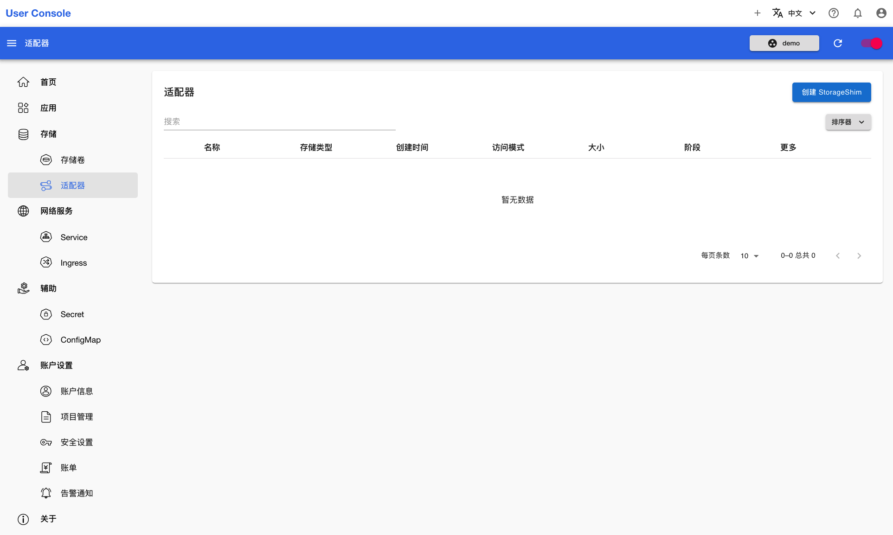
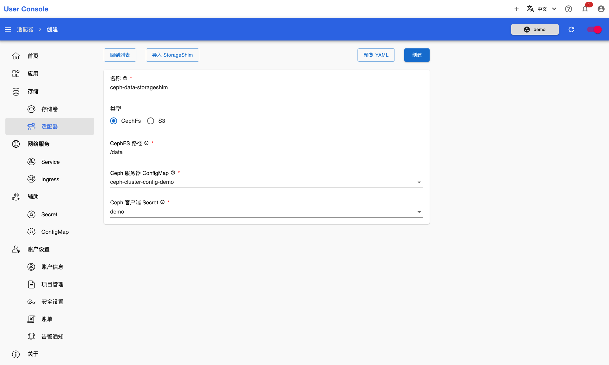
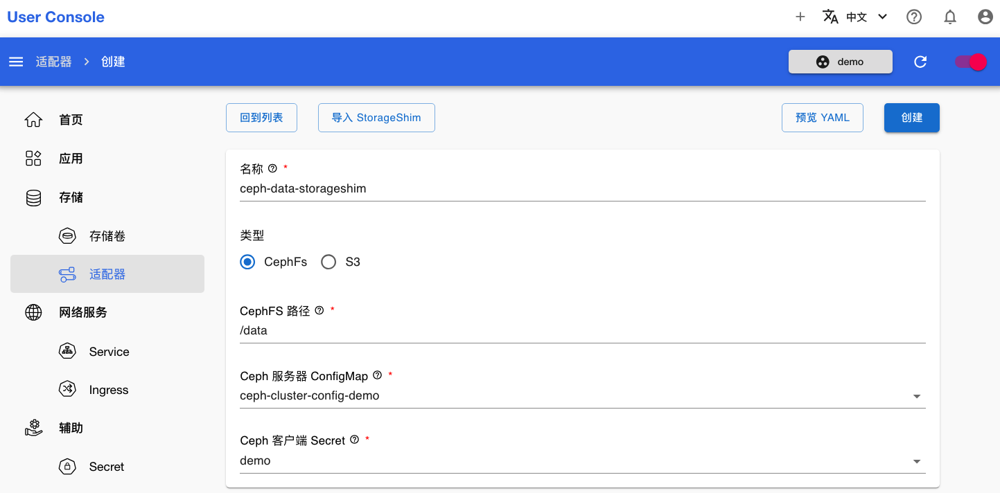

# 创建 StorageShim

<a target="_blank" rel="noopener noreferrer" href="https://t9k.github.io/user-manuals/latest/modules/storage/storageshim.html">StorageShim</a> 用于将已有的存储系统以 PVC 的形式提供给用户使用，例如将分布式文件系统的某个子目录作为一个 PVC 使用。本章演示创建 CephFs 类型的存储适配器，将 CephFs 的一个子目录作为一个 PVC。

在开始之前，你需要依靠从管理员处获得的信息，先完成[创建 Secret](../auxiliary/secret.md) 和[创建 ConfigMap](../auxiliary/configmap.md)。

点击菜单**存储 > 适配器**，打开适配器的列表页面。然后点击右上角**创建 StorageShim**，进入创建页面：

<figure class="screenshot">
  
</figure>

选择类型为 CephFs，并选择提前创建好的 Ceph 服务器 ConfigMap 和 Ceph 客户端 Secret。其中的 ConfigMap 可以是管理员创建的公共配置，或者自己创建的私有配置：

<figure class="screenshot">
  
</figure>

然后填写名称和 CephFS 路径。如果不知道可用的 CephFS 路径信息，可以询问管理员。最后点击右上角的创建：

<figure class="screenshot">
  
</figure>

创建成功后，等待适配器就绪即可：

<figure class="screenshot">
  
</figure>
