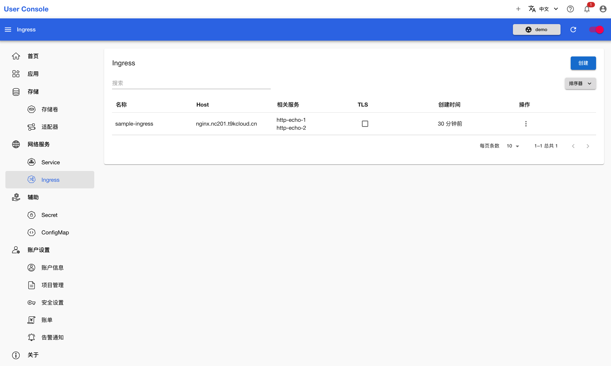

# 查看 Ingress

<a target="_blank" rel="noopener noreferrer" href="https://kubernetes.io/zh-cn/docs/concepts/services-networking/ingress/">Ingress</a> 提供从集群外部到集群内服务的 HTTP 和 HTTPS 路由。 流量路由由 Ingress 资源所定义的规则来控制。

点击**网络服务 > Ingress**，查看已有的 Ingress：

<figure class="screenshot">
  
</figure>
