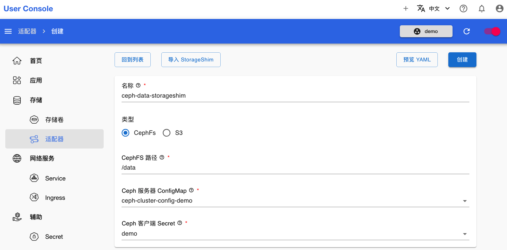

# 创建 StorageShim

<a target="_blank" rel="noopener noreferrer" href="https://t9k.github.io/user-manuals/latest/modules/storage/storageshim.html">StorageShim</a> 用于将已有的存储系统以 PVC 的形式提供给用户使用，例如将分布式文件系统的某个子目录作为一个 PVC 使用。

## CephFS 类型

本章演示创建 CephFS 类型的 StorageShim，将 CephFS 的一个子目录作为一个 PVC 使用。

在开始之前，你需要依靠从管理员处获得的信息，先完成[创建 Secret](../auxiliary/secret.md) 和[创建 ConfigMap](../auxiliary/configmap.md)。

点击菜单**存储 > 适配器**，打开适配器的列表页面。然后点击右上角**创建 StorageShim**，进入创建页面：

<figure class="screenshot">
  
</figure>

选择类型为 CephFS，并选择提前创建好的 Ceph 服务器 ConfigMap 和 Ceph 客户端 Secret。其中的 ConfigMap 可以是管理员创建的公共配置，或者自己创建的私有配置：

<figure class="screenshot">
  
</figure>

然后填写名称和 CephFS 路径。如果不知道可用的 CephFS 路径信息，可以询问管理员。最后点击右上角的创建：

<figure class="screenshot">
  
</figure>

创建成功后，等待 StorageShim 就绪即可：

<figure class="screenshot">
  
</figure>

## S3 类型

本章演示创建 CephFS 类型的 StorageShim，将 S3 的一个 bucket 或者 bucket 中的目录作为一个 PVC 使用。

在开始之前，你需要获取 S3 服务的信息，并创建一个 [`S3-cfg` 类型的 Secret](../auxiliary/secret.md#s3-cfg-类型)。

进入 StorageShim 创建页面，并选择类型为 S3：

<figure class="screenshot">
  
</figure>

填写名称、“S3 URI” 并选择 “S3 Secret”，将鼠标放在字段右侧的 <svg xmlns="http://www.w3.org/2000/svg" viewBox="0 0 24 24"><path d="M11 18h2v-2h-2v2m1-16A10 10 0 0 0 2 12a10 10 0 0 0 10 10 10 10 0 0 0 10-10A10 10 0 0 0 12 2m0 18c-4.41 0-8-3.59-8-8s3.59-8 8-8 8 3.59 8 8-3.59 8-8 8m0-14a4 4 0 0 0-4 4h2a2 2 0 0 1 2-2 2 2 0 0 1 2 2c0 2-3 1.75-3 5h2c0-2.25 3-2.5 3-5a4 4 0 0 0-4-4Z"/></svg> 上可以看到详细的说明：

<figure class="screenshot">
  
</figure>

点击右上角的创建即可完成 StorageShim 的创建。
