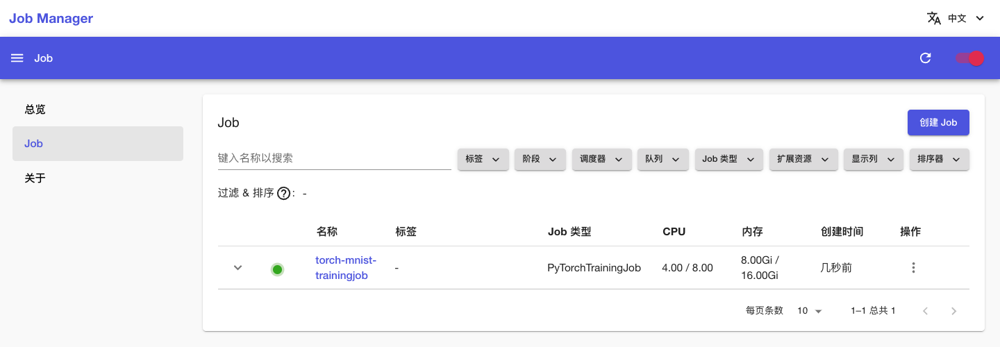
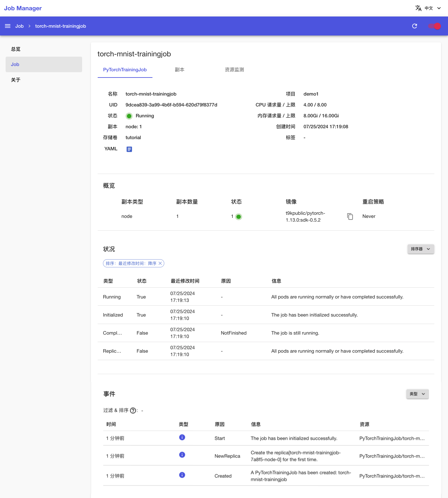
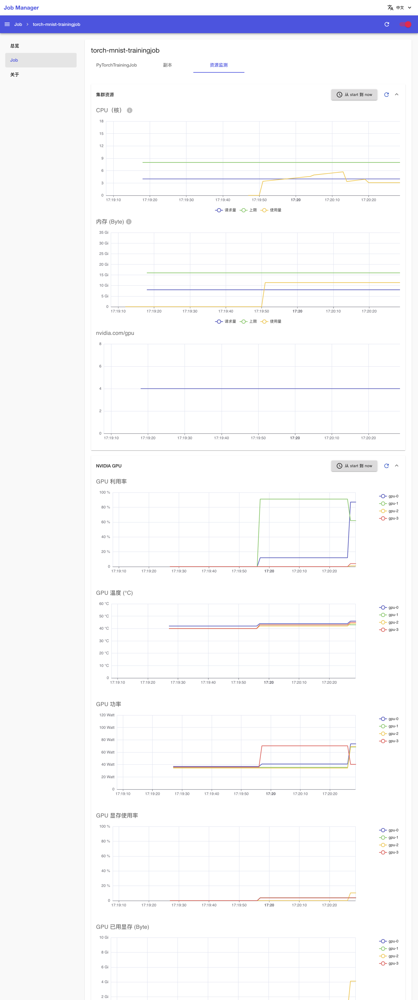
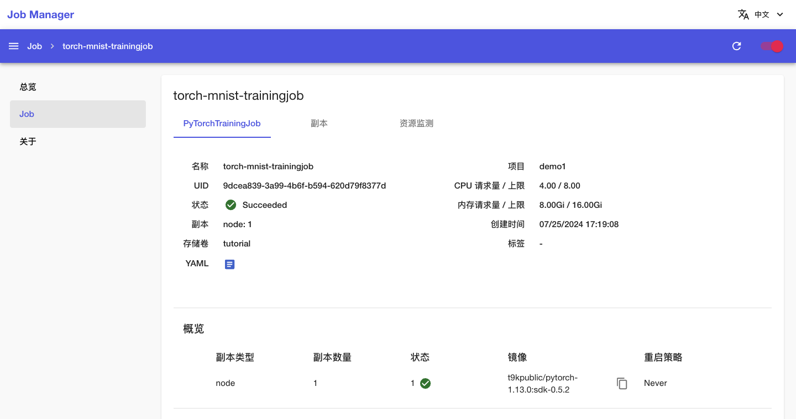
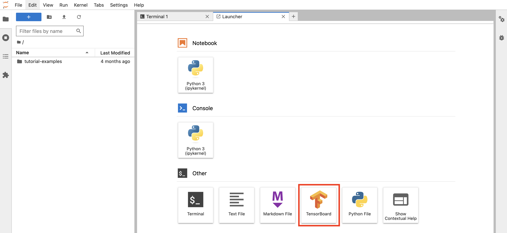
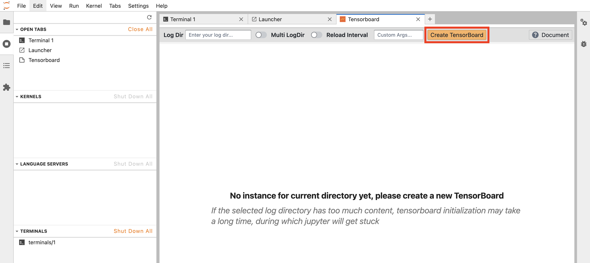

# 进行数据并行训练

本教程演示使用 <a target="_blank" rel="noopener noreferrer" href="https://t9k.github.io/user-manuals/latest/modules/jobs/pytorchtrainingjob.html">PyTorchTrainingJob</a> 对 PyTorch 模型进行多工作器同步训练（使用 <a target="_blank" rel="noopener noreferrer" href="https://pytorch.org/docs/stable/generated/torch.nn.parallel.DistributedDataParallel.html">`torch.nn.parallel.DistributedDataParallel`</a> 分布式数据并行模块）。本教程对应示例<a target="_blank" rel="noopener noreferrer" href="https://github.com/t9k/tutorial-examples/tree/master/job/pytorchtrainingjob/ddp">使用 PyTorchTrainingJob 进行数据并行训练</a>。

本教程的 Apps 架构如下图所示：

<figure class="architecture">
  
</figure>

## 运行示例

创建一个名为 tutorial、大小 1 Gi 的 [PVC](../../storage/volume.md)，然后安装一个同样名为 tutorial 的 [JupyterLab App](../../app/jupyter-lab.md)挂载该 PVC，镜像和资源不限。

进入 JupyterLab，启动一个终端，执行以下命令以克隆 `t9k/tutorial-examples` 仓库。

```bash
cd ~
git clone https://github.com/t9k/tutorial-examples.git
```

继续使用 JupyterLab 的终端，前往<a target="_blank" rel="noopener noreferrer" href="https://github.com/t9k/tutorial-examples/tree/master/job/pytorchtrainingjob/ddp">本教程对应的示例</a>，参照其 README 文档进行操作。

<aside class="note tip">
<div class="title">提示</div>

上述操作使用 YAML 配置文件创建 PyTorchTrainingJob，你也可以[在 Job Manager 进行创建]()。

</aside>

## 查看训练信息

训练开始后，安装一个 [Job Manager App](../../app/job-manager.md)（如有 Job Manager 则直接复用），进入 Job Manager，可以看到名为 **torch-mnist-trainingjob** 的 PyTorchTrainingJob 正在运行，点击其**名称**进入详情页面：

<figure class="screenshot">
    
</figure>

可以看到刚才创建的 PyTorchTrainingJob 的基本信息、状况信息和事件信息：

<figure class="screenshot">
    
</figure>

点击上方的**副本**标签页，查看 PyTorchTrainingJob 的 Pod 信息；点击副本右侧的 <span class="twemoji"><svg xmlns="http://www.w3.org/2000/svg" viewBox="0 0 24 24"><path d="M12 16a2 2 0 0 1 2 2 2 2 0 0 1-2 2 2 2 0 0 1-2-2 2 2 0 0 1 2-2m0-6a2 2 0 0 1 2 2 2 2 0 0 1-2 2 2 2 0 0 1-2-2 2 2 0 0 1 2-2m0-6a2 2 0 0 1 2 2 2 2 0 0 1-2 2 2 2 0 0 1-2-2 2 2 0 0 1 2-2Z"></path></svg></span>**&nbsp;> 日志**以查看训练脚本执行过程中的日志输出：

<figure class="screenshot">
    
</figure>

<figure class="screenshot">
    
</figure>

点击上方的**资源监测**标签页，查看 PyTorchTrainingJob 运行过程中使用集群计算资源、网络资源和存储资源的情况：

<figure class="screenshot">
    
</figure>

一段时间之后，PyTorchTrainingJob 的状态变为 **Succeeded**，表示训练成功完成。

<figure class="screenshot">
    
</figure>

若 PyTorchTrainingJob 在运行过程中出错，其状态会变为 **Error**，并在事件信息和 Pod 信息部分显示错误信息，此时需要根据给出的错误信息进行问题排查。

## 查看训练指标

训练产生的 tfevents 文件保存在 PVC 中。回到 JupyterLab，创建一个 TensorBoard 实例。点击 TensorBoard 图标：

<figure class="screenshot">
    
</figure>

直接点击 **Create TensorBoard**：

<figure class="screenshot">
    
</figure>

可以查看可视化展示的训练和验证指标：

<figure class="screenshot">
    
</figure>

<aside class="note">
<div class="title">注意</div>

JupyterLab 的 TensorBoard 实例的自动更新无效，请点击右上角的 **Reload 按钮**以手动更新。

</aside>

<aside class="note tip">
<div class="title">提示</div>

你也可以安装一个 [TensorBoard App](../../app/tensorboard.md)，展示的内容是相同的。

</aside>
