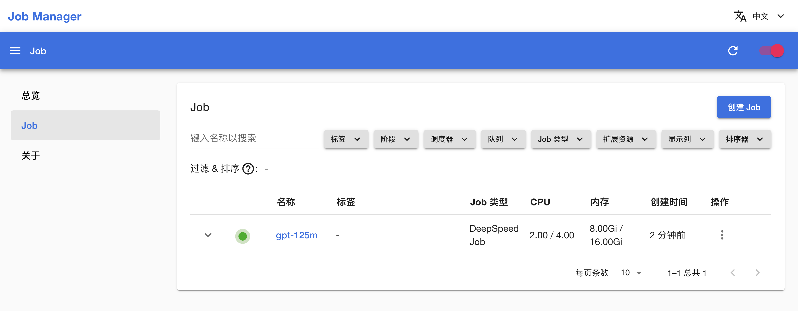
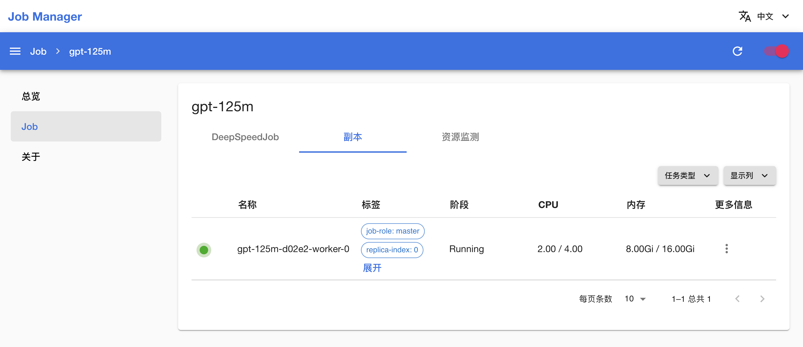
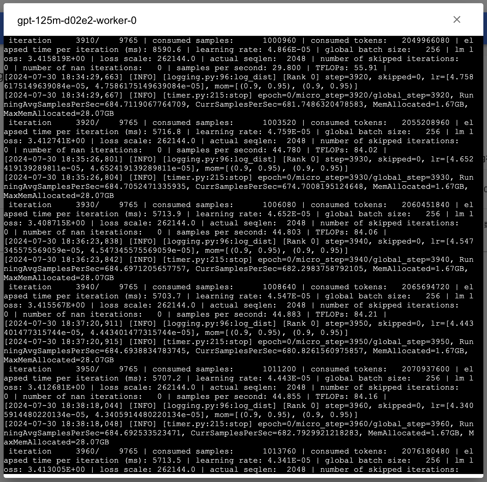
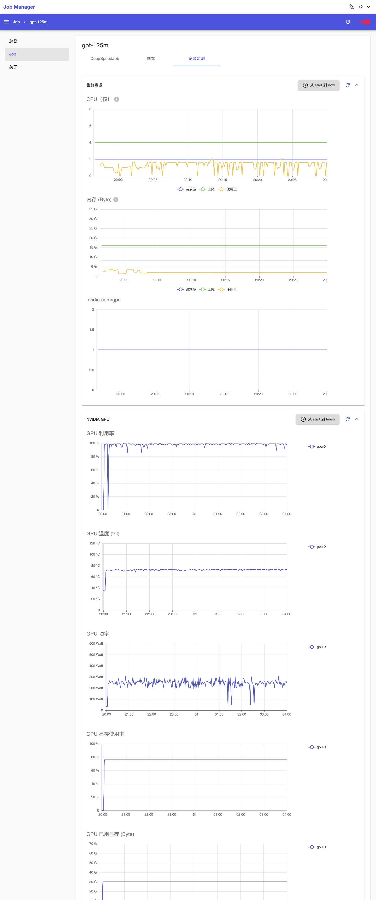
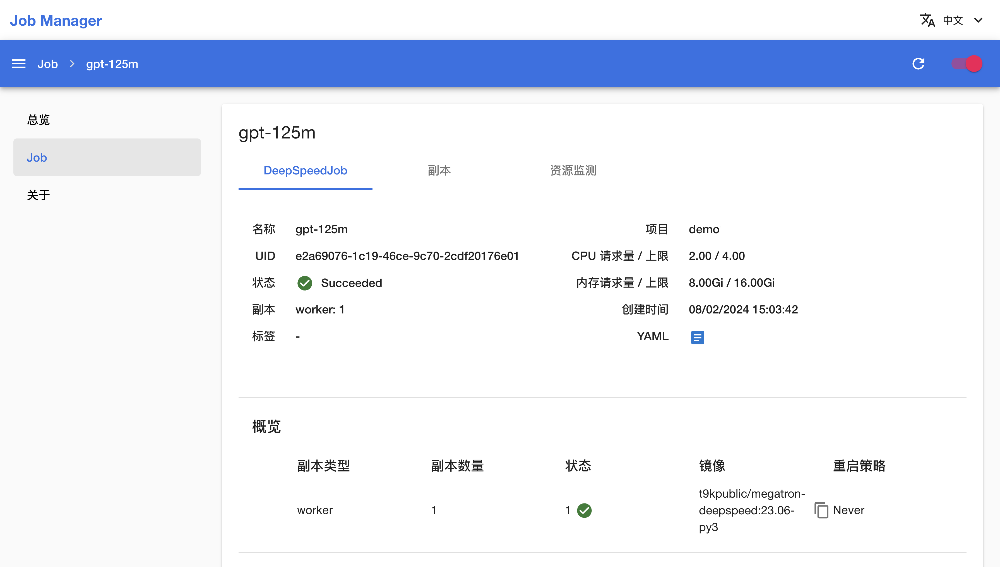
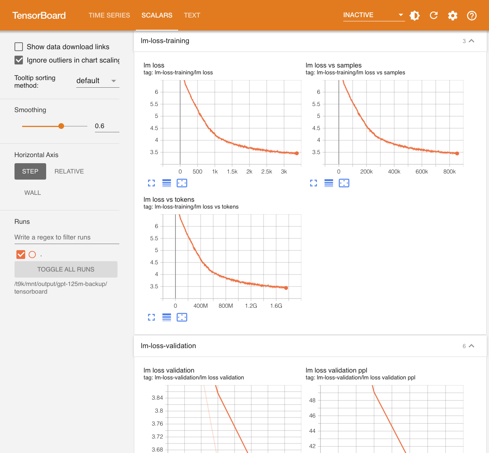

# 进行 LLM 大规模预训练

LLM（大型语言模型）是当前 AI 领域备受瞩目的研究和应用领域。预训练是构建 LLM 的初始步骤，通常需要在 GPU 集群上进行大规模（10^3~10^4 卡）的并行训练，从而使模型获得对语言结构、语义直至语言所描述的世界和各种规律的全面理解。

在集群上运行大规模模型训练面临着一些关键挑战：

* 有效地分配和管理计算资源以满足模型训练的计算需求是一项复杂任务，需要避免资源浪费和不必要的等待时间。
* 数据的并行加载和分发以及模型参数的同步和更新，需要高效的通信和协调机制，以确保训练的一致性和速度。
* 故障容错和中断恢复必不可少，因为在大规模集群上运行时硬件故障和网络问题可能导致训练中断。

<a target="_blank" rel="noopener noreferrer" href="https://github.com/microsoft/DeepSpeed">DeepSpeed</a> 是目前最受欢迎的大规模分布式训练框架，而平台提供了 [DeepSpeedJob](../modules/jobs/deepspeedjob.md)，这是专为使用 DeepSpeed 框架的分布式训练而设计的 Job 类型。

本教程演示使用 DeepSpeedJob 以简单快速的方式启动 Megatron-LM GPT-3 系列（125M、1.3B、13B 和 175B）模型的预训练任务。本教程对应示例 <a target="_blank" rel="noopener noreferrer" href="https://github.com/t9k/examples/tree/master/deepspeed/megatron-gpt">Megatron-DeepSpeed GPT</a>。

<aside class="note info">

Megatron-LM

<a target="_blank" rel="noopener noreferrer" href="https://github.com/NVIDIA/Megatron-LM">Megatron-LM</a> 是 NVIDIA 应用深度学习研究团队开发的大型 transformer 代码库，用于高效地训练多达 1 trillion 参数的 LLM，并实现了多种并行技术。<a target="_blank" rel="noopener noreferrer" href="https://github.com/microsoft/Megatron-DeepSpeed">Megatron-DeepSpeed</a> 是 DeepSpeed 版本的 Megatron-LM，其增加了对几个功能的额外支持，如 MoE 训练、课程学习、3D 并行性等。

本示例所使用的训练代码即来自这两个项目。

</aside>

本教程的应用架构如下图所示：

<figure class="architecture">
  
</figure>

## 运行示例

创建一个名为 megatron、大小 250 GiB 以上的 PVC，然后部署一个同样名为 megatron 的 JupyterLab 应用挂载该 PVC，镜像选用 PyTorch 2 类型，计算资源申请 16 个 CPU（核心）、32 GiB 内存。

进入 JupyterLab，启动一个终端，前往<a target="_blank" rel="noopener noreferrer" href="https://github.com/t9k/examples/tree/master/deepspeed/megatron-gpt">本教程对应的示例</a>，参照其 README 文档进行操作。

## 查看训练信息

训练开始后，部署一个 [Job Manager 应用](../../app/job-manager.md)（如有 Job Manager 则直接复用），进入 Job Manager，可以看到名为 **gpt-125m** 的 DeepSpeedJob 正在运行，点击其**名称**进入详情页面：

<figure class="screenshot">
    
</figure>

可以看到刚才创建的 DeepSpeedJob 的基本信息、状况信息和事件信息：

<figure class="screenshot">
    
</figure>

点击上方的**副本**标签页，查看 DeepSpeedJob 的 Pod 信息；点击副本右侧的 <svg xmlns="http://www.w3.org/2000/svg" viewBox="0 0 24 24"><path d="M12 16a2 2 0 0 1 2 2 2 2 0 0 1-2 2 2 2 0 0 1-2-2 2 2 0 0 1 2-2m0-6a2 2 0 0 1 2 2 2 2 0 0 1-2 2 2 2 0 0 1-2-2 2 2 0 0 1 2-2m0-6a2 2 0 0 1 2 2 2 2 0 0 1-2 2 2 2 0 0 1-2-2 2 2 0 0 1 2-2Z"></path></svg>**&nbsp;> 日志**以查看训练脚本执行过程中的日志输出：

<figure class="screenshot">
    
</figure>

<figure class="screenshot">
    
</figure>

点击上方的**资源监测**标签页，查看 DeepSpeedJob 运行过程中使用集群计算资源、网络资源和存储资源的情况：

<figure class="screenshot">
    
</figure>

一段时间之后，DeepSpeedJob 的状态变为 **Succeeded**，表示训练成功完成。

<figure class="screenshot">
    
</figure>

训练完成之后，模型文件将保存到 `output/gpt-125m/model` 路径下，后续用于<a target="_blank" rel="noopener noreferrer" href="https://github.com/t9k/examples/tree/master/deepspeed/megatron-gpt#%E6%96%87%E6%9C%AC%E7%94%9F%E6%88%90">文本生成</a>或进一步的微调。

若 DeepSpeedJob 在运行过程中出错，其状态会变为 **Error**，并在事件信息和 Pod 信息部分显示错误信息，此时需要根据给出的错误信息进行问题排查。

## 查看训练指标

训练产生的 tfevents 文件保存在 `output/gpt-125m/tensorboard` 路径下，可以[在 JupyterLab 中创建一个 TensorBoard 实例](./dp-training.md#查看训练指标)或部署一个 [TensorBoard 应用](../../app/tensorboard.md)以查看：

<figure class="screenshot">
  
</figure>

## 使用其他训练配置

`examples/deepspeed/megatron-gpt/training` 路径下有多个 YAML 配置文件，分别对应不同模型参数量的不同并行训练策略，细节如下表所示：

| 参数量 | 训练 token 量 | 数据集 | 配置文件                      | 并行策略                               | GPU 使用（参考） | 预计时间* |
| ------ | ------------- | ------ | ----------------------------- | -------------------------------------- | ---------------- | --------- |
| 125M   | 2.5B          | enwiki | `gpt-125m.yaml`               | -                                      | 1x A100 40GB     | ~8h       |
|        |               |        | `gpt-125m-2xdp.yaml`          | 2x数据并行                             | 2x A100 40GB     | ~4h       |
|        |               |        | `gpt-125m-4xdp.yaml`          | 4x数据并行                             | 4x A100 40GB     | ~2h       |
| 1.3B   | 26B           | enwiki | `gpt-1-3b-4xdp.yaml`          | 4x数据并行                             | 4x A100 40GB     | ~8d       |
|        |               |        | `gpt-1-3b-8xdp.yaml`          | 8x数据并行                             | 8x A100 40GB     | ~4d       |
|        |               |        | `gpt-1-3b-4xdp-4xpp.yaml`     | 4x数据并行 + 4x流水线并行              | 2x 8x A100 40GB  |           |
| 13B    | 260B          | enwiki | `gpt-13b-4xdp-4xpp.yaml`      | 4x数据并行 + 4x流水线并行              | 2x 8x A100 80GB  |           |
|        |               |        | `gpt-13b-4xdp-8xpp.yaml`      | 4x数据并行 + 8x流水线并行              | 4x 8x A100 80GB  |           |
|        |               |        | `gpt-13b-4xdp-4xpp-4xtp.yaml` | 4x数据并行 + 4x流水线并行 + 4x张量并行 | 8x 8x A100 80GB  |           |
| 175B   | 3.5T          |        | (WIP)                         |                                        |                  |           |

*预计时间为参考值，与具体的硬件环境有关，这里以 A100 PCIE 40GB GPU 节点为例

## 参考

* <a target="_blank" rel="noopener noreferrer" href="https://github.com/NVIDIA/Megatron-LM">Megatron-LM</a>
* <a target="_blank" rel="noopener noreferrer" href="https://github.com/microsoft/Megatron-DeepSpeed">Megatron-DeepSpeed</a>
* <a target="_blank" rel="noopener noreferrer" href="https://github.com/microsoft/DeepSpeed">DeepSpeed</a>
