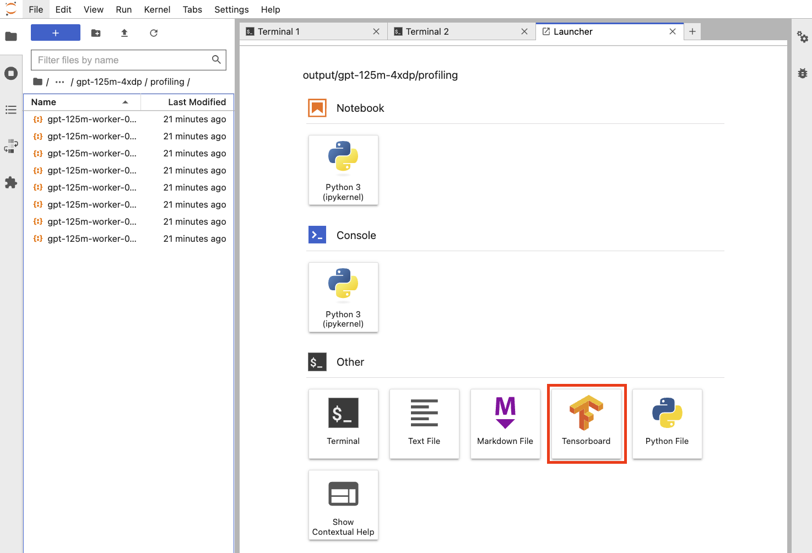
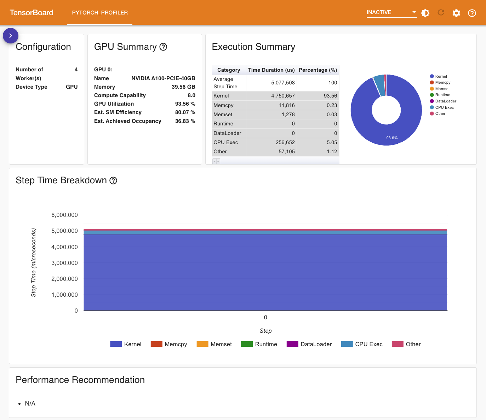

# 分析性能

PyTorch 提供的 <a target="_blank" rel="noopener noreferrer" href="https://pytorch.org/docs/stable/profiler.html">profiler 工具</a>允许在训练和推理过程中收集性能指标，帮助开发者识别代码中的性能瓶颈和优化机会。它可以测量 CPU 和 GPU 上的操作执行时间、内存使用情况以及其他硬件利用率指标。通过使用 profiler，用户可以详细分析每个操作的耗时，追踪张量形状和类型，并生成可视化报告来直观地展示性能数据。这使得开发者能够更好地理解模型的运行特性，从而进行针对性的优化，提高模型的训练和推理效率。用户在 [JupyterLab 应用](../../app/jupyter-lab.md)中可以方便地使用这一工具。

本教程演示如何在 JupyterLab 应用中对[进行 LLM 大规模预训练](./llm-large-scale-pretraining.md)中的训练进行性能分析。

## 准备工作

在[进行 LLM 大规模预训练](../examples/start-llm-large-scale-pretraining.md)给出的准备工作的基础上，还需要修改 Megatron-DeepSpeed 的训练代码，用 profiler 上下文管理器包装训练循环的代码。直接使用 Notebook 的文本编辑器修改代码即可。

```python
# Megatron-DeepSpeed/megatron/training.py
...

    profile_path = os.path.join(os.path.dirname(args.tensorboard_dir), 'profiling')

    with torch.profiler.profile(
            schedule=torch.profiler.schedule(wait=1, warmup=1, active=3, repeat=2),
            on_trace_ready=torch.profiler.tensorboard_trace_handler(profile_path),
            record_shapes=True,
            profile_memory=True,
            with_stack=True,
            with_flops=True,
            with_modules=True
    ) as prof:  # profiler context manager
        while iteration < args.train_iters and (args.train_tokens is None or \
            args.consumed_train_tokens < args.train_tokens):  # training loop

            ...

            prof.step()

...
```

其中对于 profiler 的配置为：

* profiler 跳过 1 个 step，热身 1 个 step，然后记录 3 个 step；总共重复 2 次。
* 生成用于 TensorBoard 展示的结果文件，与 TensorBoard 日志文件保存到同一父目录下。
* 记录算子的源信息和输入形状，记录模块（module）的调用栈，估计 FLOPS，跟踪张量内存的分配和释放。

## 启动性能分析

以 4 个 GPU 训练 125M 参数的 GPT 模型，启动训练：

```bash
kubectl create -f \
  examples/deepspeed/megatron-gpt/training/gpt-125m-4xdp.yaml
```

通过以下命令查看训练过程中打印的日志：

```bash
export POD=$(kubectl get dj gpt-125m -o jsonpath="{.status.tasks[0].replicas[0].name}")
kubectl logs $POD -f
```

<figure class="screenshot">
  
</figure>

性能分析完成之后，结果文件被保存在 `output/gpt-125m-4xdp/profiling` 路径下，前往该路径并启动一个 TensorBoard 实例以查看可视化结果。

<figure class="screenshot">
  
</figure>

## 查看可视化结果

Overview 展示了训练性能的总体情况，包含 GPU 的总体情况、不同执行类别花费的时间和占比，以及自动生成的性能优化建议：

<figure class="screenshot">
  
</figure>


Operator View 展示了所有 PyTorch 算子被调用的次数、花费的时间以及它的调用栈：

<figure class="screenshot">
  
</figure>

Kernel View 展示了所有 GPU 内核被调用的次数、花费的时间的统计以及它是否使用了 Tensor Core 等：

<figure class="screenshot">
  
</figure>

Memory View 展示了内存使用曲线图、内存事件（分配和释放）以及内存统计数据：

<figure class="screenshot">
  
</figure>

TensorBoard 所展示的数据和提供的功能还远不止这些，请参阅<a target="_blank" rel="noopener noreferrer" href="https://pytorch.org/tutorials/intermediate/tensorboard_profiler_tutorial.html">官方教程</a>以了解更多。这些数据应当能为用户分析和改进性能提供非常有用的帮助。
