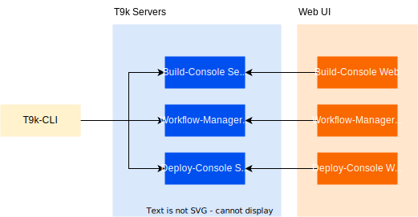

# 命令行工具：t9k

TensorStack CLI（简称 T9k CLI）是 TensorStack AI 平台的命令行工具，用于对 TensorStack AI 平台的各种资源对象进行增、删、改、查操作。

<aside class="note info">

信息

如果你使用过 kubectl，那么你可以将 T9k CLI 看作面向 T9k 资源的 kubectl（但是 T9k CLI 采用了资源对象在前、操作在后的语法格式，例如 `t9k notebook get -A`）。这样的类比能帮助你非常快速地理解 T9k CLI 的用法。但是不了解 kubectl 也不会影响你阅读本文档，你可以从本文档中学会 T9k CLI 的使用方式。

</aside>

## 功能

TensorStack CLI 目前包含了两大功能：其一是管理 T9k 集群计算资源分配，主要的使用者是 TensorStack AI 平台管理员；其二是管理 TensorStack AI 平台中被创建的作业、服务等资源，主要的使用者是使用平台进行机器学习模型开发、训练、部署等工作的数据科学家。

TensorStack CLI 的目标是：提供对于 T9k 自定义资源的有效支持。对于平台管理员来说，这些功能可以作为 kubectl 的补充来管理 TensorStack AI 平台。对于数据科学家来说，这些功能和控制台一起，帮助他们在 TensorStack AI 平台上开展机器学习相关的工作，而不需要过多的 Kubernetes 基础知识。

<figure>
  
</figure>

图 1：T9k CLI 示意图

## 资源类型

T9k CLI 支持的资源类型有：

* 基于 Kubernetes 定义的，用来解决机器学习相关问题的 TensorStack AI 平台资源：
  * AutoTune
  * BeamJob
  * ColossalAIJob
  * DeepSpeedJob
  * GenericJob
  * MLService
  * MPIJob
  * Notebook
  * PyTorchTrainingJob
  * SimpleMLService
  * TensorFlowTrainingJob
  * WorkflowTemplate
  * WorkflowRun
  * XGBoostTrainingJob
* 基于 Kubernetes 定义的，用来管理集群资源及权限的 TensorStack AI 平台资源：
  * PodGroup
  * Project
  * Queue
